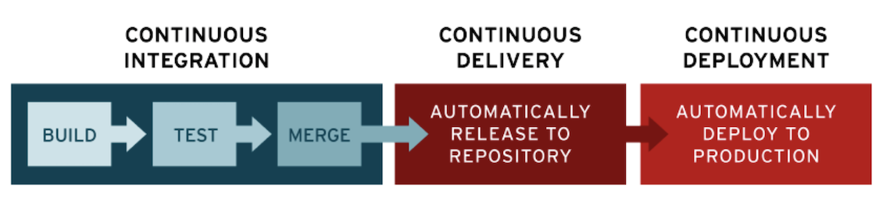
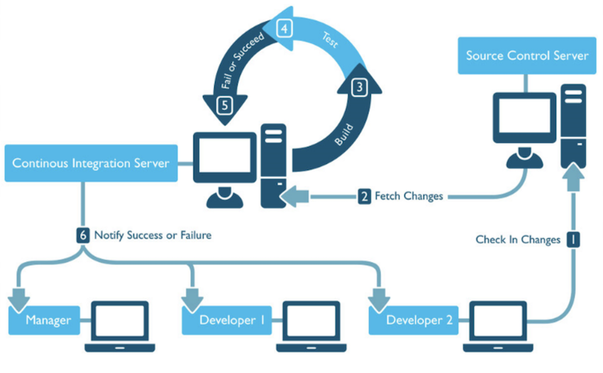
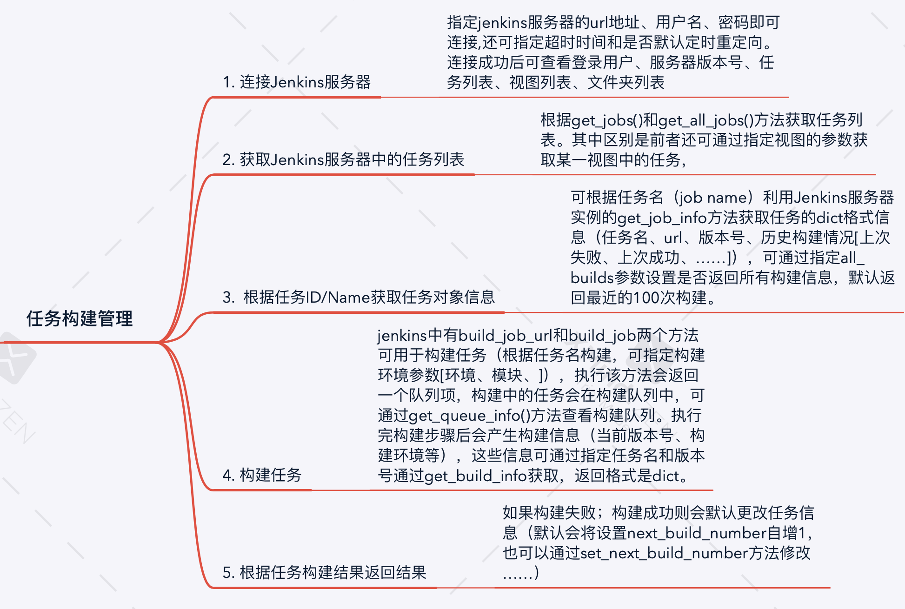

## 前言
前段时间的参与了自动化测试平台的开发，本文就进行一些梳理，简单总结以下要点：
- 为什么要自动化测试？
- 如何实现自动化测试？
- 如何基于Jenkins实现持续集成？

### 为什么要自动化测试？
在一个产品的开发流程中往往会涉及到产品经理、开发团队、测试团队等团队的协作，一般情况下是开发拿到产品需求之后进行开发工作，开发完毕之后给测试团队根据一系列的测试方案指标对软件/程序进行一系列的测试（功能测试、性能测试、安全测试、部署测试等等），如果测试团队确认没有问题那么就可以进行版本的发布，如果有bug则要让开发团队修补，直到没有bug再正式部署。
这个过程中开发与测试的沟通对接次数可能是非常多的，项目排期很紧的时候，测试可能经常需要等开发“修完”bug，这个过程或许还要经常（不情愿地）陪着开发团队加班；而开发团队在“修完”bug之后也要“提心吊胆”地等待测试团队的结果。

这时候人们就想：
> 能不能事先写一个系统，里面包含了设计好的测试用例，等开发完上传代码之后系统会自动拉取代码进行构建，然后即时生成测试报告返回给开发团队？

这就是自动化测试所考虑的问题，总结一下，自动化测试所要解决的痛点是：
- 针对测试人员：将测试人员从大多数简单而重复性高的测试工作解放出来，更多关注业务逻辑
- 针对开发人员：写完了代码之后可以直接获取测试报告，没通过就直接改，通过了就做下一个需求

### 如何实现自动化测试？
要实现自动化测试，首先要知道一个项目从需求期到上线要经过什么流程：需求分析、设计、开发、测试、上线。而对于团队型的开发而言，往往会涉及到代码的集成（如将多个分支的代码集成到主分支中）、交付（开发将新版本软件交付给测试团队或者用户）、部署（确保代码质量后将软件上线，投入使用）。所谓的自动化，就可以从“集成”、“交付”、“部署”处着手，考虑如何提高这几个环节的效率。

于是就有人提出了持续集成、持续交付、持续部署之类的概念。

或许你已经在哪里见过CI/CD、DevOps的术语，所谓CI/CD，分别指持续集成（Continuous integration）、持续交付（Continuous Delivery）和持续部署（Continuous Deployment）。其含义如下：
> 持续集成：频繁地将代码集成到主干分支。

> 持续交付：频繁地将软件的新版本，交付给质量团队或者用户，以供评审。如果评审通过，代码就进入生产阶段

> 持续部署：代码通过评审以后，自动部署到生产环境

> DevOps: 通过自动化“软件交付”和“架构变更”的流程，来使得构建、测试、发布软件能够更加地快捷、频繁和可靠。

关键之处，就是在项目开发过程中，实现高度持续的自动化与监控，尽可能减少由于人员交接所带来的效率损失。

### 疑问
当然，在面对自动化测试的时候，你可能还会考虑如下问题：
- 所有项目都适合自动化测试吗？什么样的项目/功能/接口可以进行自动化测试？
- 自动化测试所耗费的时间与金钱成本值得承受吗？会给我们带来多大的效率提升？

这里先忽略这些问题，假设项目可以进行自动化测试，并简单分析其中的持续集成模块。

## 持续集成
要做到持续集成，需要实现如下功能：
1. 监测开发分支是否有更改

2. 若分支有变化，则自动拉取变化的代码，进行如下操作：

    (1) 尝试进行构建

    (2) 若构建成功则运行测试用例，包括单元测试和业务逻辑测试
  
    (3) 通知开发者构建结果和测试结果（可以是邮件发送测试报告），并进行日志记录

3. 开发分支通过测试则尝试进行集成

CI的工作流可以如下图所示：

比较著名的持续集成工具有[jenkins](https://www.jenkins.io)、[Travis CI](https://github.com/travis-ci/travis-ci)、[Buddy](https://buddy.works/)等。

以Jenkins为例, Jenkins是由Java编写的开源持续集成工具，且已经提供多种语言的接口（C/C++、Python、PHP、Android等），具有如下特点:
1. 易安装。通过Jenkins.war包进行直接运行，无需安装，无需数据库。

2. 易扩展。可以在线更新插件，也可以自己开发插件，现有的插件库已经比较丰富能够满足大多数需求。

3. 支持分布式构建。主从方式使jenkins能够让多台计算机同时工作。

4. 构建前、构建后可定义自己要进行的操作。比如添加代码扫描或者安全扫描，构建完成通过邮件/RSS等通讯工具实时告知构建结果，可以更方便把控产品质量。

以python接口为例，通过jenkins实现任务构建管理的基本逻辑如下：

## 小结
本文对于自动化测试这么大的题目而言，所述甚微，也不涉及技术细节，更多关于持续交付、部署的内容日后补充。

回到一开始所提的两个疑问。

首先，什么样的项目适合进行自动化测试？

要测试的对象包括单个接口、性能、安全、业务逻辑、易用性等等，我们知道**执行频率高且机械化的重复操作**肯定是适合自动化测试的，这里包括对那些用户交互性要求较弱的接口进行单元测试、性能测试、大量数据输入测试、配置测试等。对于那些用户交互要求高的功能，比如涉及复杂业务规则，涉及感官（视觉、听觉）测试，涉及物理交互（刷卡、打印等）的功能自动化测试就很难实施或者说实施成本过高而没有必要了。

再者，有必要建设自动化测试平台吗？是否真的能够带来效率提升？什么情况下才能有效率提升？

这实际上是一个投资与回报的权衡问题。建设自动化平台是需要很大成本的：组建一个测试开发团队、设计测试架构、多个团队配合开发自动化平台、将现有业务代码接入自动化平台、……。如果没有足够多的业务线，足够多的需求（可以带来产出），建设自动化测试平台或许就只是杀鸡用牛刀，但如果说有足够的业务场景支撑，那么多组建一个测开团队整一个自动化平台可以造福多个开发团队，在长期发展中获得回报。

## 参考资料
- [CI/CD是什么？如何理解持续集成、持续交付和持续部署](https://www.redhat.com/zh/topics/devops/what-is-ci-cd)
- [Continuous Integration: A “Typical” Process](https://developers.redhat.com/blog/2017/09/06/continuous-integration-a-typical-process/)

- [Jenkins官方文档](https://www.jenkins.io/zh/doc/tutorials/)

- [如何理解持续集成、持续交付、持续部署？](https://www.zhihu.com/question/23444990)