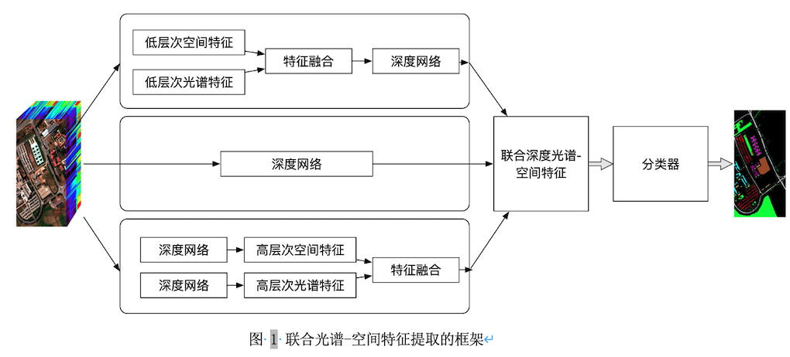

# 高光谱影像分类

- 什么是高光谱影像？

- 高光谱信息有什么应用价值？

- 高光谱影像分析有何难点？

- 高光谱影像分析主要有哪些方法？当前的主流是什么？

- 对于高光谱信息利用有何展望？

## 引言
高光谱传感器通过大量不同波段的电磁频谱来探测物体，得到高光谱影像。由于高光谱传感器的信息收集范围可以覆盖整个电磁波谱的信息，远远超过人眼可辨别的可见光波段，使得高光谱影像中蕴含了更丰富的可供解读的信息（如虾蛄利用高光谱信息分辨珊瑚、猎物、猎食者），并使得高光谱影像成为一个热门的研究主题。高光谱影像中所包含的信息组分有空间信息和光谱信息，由于可区分细节的程度不同，又有空间分辨率和光谱分辨率的概念。空间分辨率可以定义为影像中的最小可分辨细节(Gonzales and Woods 2002)，光谱分辨率可以定义为传感器测量的光谱波段数量和电磁光谱范围(Richason 1978)。多光谱影向的光谱分辨率较低，因此难以解析场景中所存在的更精细的光谱特征，而高光谱传感器可以在电磁光谱的中红外、近红外和可见光波段中获取大量连续且极为狭窄的光谱信息，这些独特的光谱特征(Goetz, Vane et al. 1985)对于精细的地物、材料识别而言具有重大价值。由于高光谱传感器访问同一个区域时具有一定的周期性，所以影像又具有时间分辨率的概念：传感器平台从完全相同的位置出发到重新访问该位置并获取数据所需要的时间(Théau 2008)。空间、光谱、时间特征的复杂性都是高光谱影像分析中所面临的挑战的来源。

高光谱影像分类试图根据影像中的像素向量为每个像素向量分配类别标签，但由于高光谱影像中存在冗余特征、可用训练样本有限、样本类别不平衡及数据维度灾难等原因，高光谱影像分类面临很大的挑战(Ghamisi, Plaza et al. 2017)，这也使得传统数字图像处理领域为灰度图、彩色图或多光谱图像所设计的图像分类方法并不能直接应用于高光谱影像分类。机器学习和深度学习的崛起为高光谱影像分类带来了新的思路。本文剩余部分将介绍当前用于高光谱影像分类的方法、应用，并对其进行分类总结。

## 相关工作
### 机器学习视角
在高光谱影像分类的早期，大多数研究者主要探索影像的光谱特征对于特定场景下分类的效用，从而提出了很多像素级别的分类方法，如神经网络、支持向量机(Mercier and Lennon 2003)、逻辑回归、随机森林等；此外，一些方法着重于设计有效的特征提取或将为基数，如主成分分析(Licciardi, Marpu et al. 2011)、独立成分分析(Villa, Benediktsson et al. 2011)和线性判别分析(Bandos, Bruzzone et al. 2009)。然而，由于缺少对空间上下文信息的考虑，像素级别的分类器的表现始终不能让人满意。一些研究者的工作表明空间特征对于改善高光谱影像的特征表示和增加分类精度而言作用显著(He, Li et al. 2017)，于是很多研究者着手研究基于空间光谱特征的分类框架，将空间上下文信息融合到像素级的分类器中,如通过多种形态学操作(Ghamisi, Maggiori et al. 2018)、多核学习(Fang, Li et al. 2015)、多特征学习(Li, Huang et al. 2014)等技术来利用空间信息。

### 深度学习视角
尽管传统机器学习方法大大增强了高光谱影像分类，但高性能的分类器往往要求设计良好的分类特征，这高度依赖于专家知识、经验，且一次设计的特征往往是针对特定任务的，即基于手工特征所训练出的分类模型难以迁移到其他场景。而高光谱数据固有的复杂特性又使得人工设计分类特征工作量巨大，设计并训练一个工作良好的分类器需要消耗很大成本。如何在大幅减少人工设计分类特征的工作量的情况下训练出表现优异的分类器具有重要的价值。

随着深度学习的崛起，深度学习已被公认为非线性关系学习的强大工具，推动了计算机视觉(Krizhevsky, Sutskever et al. 2017)、自然语言处理(Collobert and Weston 2008)等领域的发展，其优良的表现源于其具有强大的特征抽取能力以及对复杂函数具有强大的逼近能力(Goodfellow, Bengio et al. 2016)，且在应用时减少了对专家知识的依赖性。遥感领域也已经提出了许多用于高光谱影像特征提取和分类的深度学习模型(Chen, Lin et al. 2014)，如基于自动编码器(Tao, Pan et al. 2015)、深度信念网络(Chen, Zhao et al. 2015)、卷积神经网络(Romero, Gatta et al. 2015)、循环神经网络(Mou, Ghamisi et al. 2017)和生成对抗网络(Zhan, Hu et al. 2017)的方法。

可以根据网络提取特征的差异，将用于高光谱影像分类的深度网络分为光谱特征网络、空间特征网络、空间光谱特征网络，不同网络将提取相应的特征以辅助后续的分类。
-	光谱特征网络

光谱信息是高光谱影像中最重要的特征，对于分类任务而言具有至关重要的作用。然而高光谱传感器通常会提供上百个波段的信息，其中还包括一些冗余信息，因此原始的光谱向量不仅会导致极高的计算复杂度，还不一定能提高分类精度。尽管类似主成分分析、独立成分分析、线性判别分析的方法可提取有效的光谱特征，但这些线性模型中的线性过程难以捕获高光谱影像中复杂的光谱特征，于是研究者采用深度学习的框架来提取光谱特征，也称为光谱特征网络。
最早的光谱特征网络将高光谱像素向量直接输入到全连接网络，如基于堆叠自编码器(Chen, Lin et al. 2014)、深度信念网络(Chen, Zhao et al. 2015)的工作。随后，一些研究者提出利用深度学习和主动学习的框架来改进高光谱影像分类方法(Liu, Zhang et al. 2016)，其中使用深度信念网络提取光谱特征，并应用主动学习算法来选择高质量的标注样本作为训练样本。除此之外，还有利用字典学习来从高光谱影像中提取多层次的字典特征的工作(Tariyal, Aggarwal et al. 2016)，取得了较高的分类精度。

-	空间特征网络

文章之前部分已经说明了将利用空间特征可以进一步提高影像分类精度。有研究者考虑利用深度网络来提取高光谱影像的空间特征，这样的深度网络被称为空间特征网络。一些研究者先通过主成分分析降低高光谱影像特征的维度，再通过2维的卷积神经网络将每个像素的邻域信息融合(Fang, Liu et al. 2019)，如此将空间信息利用起来。还有一些研究者利用稀疏表示技术将深度空间特征编码成低维的稀疏特征，也提高了特征表示的能力和分类任务的精度(Liang and Li 2016)。

- 空间光谱特征网络

除了去设计深度网络来提取单一类型的光谱特征或空间特征以外，还可以设计网络来提取联合的光谱-空间特征。联合特征可以通过如下三种方式获得：1）通过深度网络将低层次的光谱空间特征映射到高层次的光谱空间特征；2）直接从原始数据的主成分中提取深度特征；3）融合两种类型的高层次特征（空间特征和光谱特征），如(Xu, Li et al. 2017) 双分支的卷积神经网络架构实现联合光谱-空间特征的提取。

## 高光谱影像分类的应用
高光谱影像在商业、农业与军事等领域具有广泛应用。本文介绍其在食品质量与安全评估、医疗诊断、精细农业和法证检查的应用。

###  食品质量与安全评估
由于对高效率和低成本食品日益增长的需求，食品工业正面临众多挑战，例如在确保食品质量和安全性同时避免责任问题。可以通过检查食品的各种物理，化学和生物特性来评估食品的质量和安全性。但通过肉眼查看、化学、生物试探等传统检查手段对食品具有破坏性且耗费时间，因此有人通过计算机视觉的方式来评估食品的外部属性(Huang, Liu et al. 2013)。但由于广泛光谱信息的缺失，传统基于机器视觉的食品质量评估方法面临局限性。

高光谱影像包含丰富的光谱信息和空间信息，使得基于高光谱影像的方法适合评估食品质量和安全性(Qiao, Ngadi et al. 2007)，目前已有关于利用高光谱影像分析的方法用于识别食品中的缺陷和污染物的工作(Leiva-Valenzuela, Lu et al. 2013)。

### 医疗诊断
传统上利用计算机断层扫描和磁共振成像进行临床分析，而现代光谱成像技术以更高的速度和精度为医疗专家提供了更强的辅助工具，证明了其在辅助医疗中的重要性。组织的光学特征可以提供有价值的诊断信息，高光谱影像由于能够提供生物组织的更广泛的光谱信息而具有更大的应用潜力。

Kumar等人提出一种基于主成分分析和傅里叶变换的红外光谱成像系统来进行乳腺癌辅助诊断(Kumar, Desmedt et al. 2013)；一些研究者则通过对舌头的反射光谱分析进行肿瘤检测(Liu, Wang et al. 2012)；还有人通过荧光反射成像扫描组织的胆汁结构以鉴定胆囊疾病(Mitra, Melvin et al. 2012)。
### 精细农业
传统的农作物疾病检测、水分/养分缺失察看、昆虫侵袭监测时通过目视法进行的，这些方法会受到一些限制，如一些作物的视觉症状往往会出现在疾病的后期，因此即便发现症状也很难恢复植物健康。
机载与地面式的高光谱影像分析方法的进步使得我们可以用更经济高效的手段分析土壤和植被特征成为可能。一些研究者通过便携式高光谱成像系统估计叶片的水分胁迫(Rascher, Nichol et al. 2007)，检测玉米农场的干旱胁迫(Rossini, Fava et al. 2013)。还有一些研究者通过分析高光谱影像分析光谱特征与污染物含量的关系，如有人发现芥菜中的汞含量与光谱特征高度相关(Dunagan, Gilmore et al. 2007)。
### 法证检查
以往法证专家往往通过化学溶液来研究重要历史文献的外在和内在成分(Aginsky 1993)，而不同温度所使用的墨水是由具有不同化学和物理性质的物质组成，这些物质在不同的环境下以独特的方式与不同的底物进行反应，为化学手段的文档分析带来挑战。基于化学溶液的分析方法还具有耗时、对温度变化敏感、对被分析物具有破坏性等局限。

为了克服以上限制，高光谱影像可以作为一种有效的非破坏性分析工具(Kim, Deng et al. 2011)。在法医文档分析场景下，高光谱文件成像原理是文件中存在的每种墨水都有自己独特的光谱特征，可使用多种数学工具对这些光谱特征分类，从而区分不同的文档，提高分类的精度。有研究者提出基于高光谱分解的技术区分文档中不同笔的墨水(Abbas, Khurshid et al. 2017)，区分不同墨水的混合比(Khan, Yousaf et al. 2018)，区分伪造文档等。

## 参考
[What are Hyperspectral Images?](https://towardsdatascience.com/what-are-hyper-spectral-images-a5de5d9fa91)

## 文章汇总
### 图像分类
#### Review
- [IJRS 2007] A survey of image classification methods and techniques for improving classification performance. [[paper]](https://www.tandfonline.com/doi/abs/10.1080/01431160600746456)

### 高光谱影像
#### Review
- [MGRS 2017]Advanced Spectral Classifiers for Hyperspectral Images: A review [[paper]](https://ieeexplore.ieee.org/abstract/document/7882742)

- [TGRS 2017] Recent Advances on Spectral–Spatial Hyperspectral Image Classification: An Overview and New Guidelines [[paper]](https://ieeexplore.ieee.org/abstract/document/8101519)

- [TGRS 2019] Deep Learning for Hyperspectral Image Classification: An Overview [[paper]](https://ieeexplore.ieee.org/abstract/document/8697135/)

- [Imaging 2019] Deep Learning Meets Hyperspectral Image Analysis: A Multidisciplinary Review [[paper]](https://www.mdpi.com/2313-433X/5/5/52)

#### Methods

- [TGRS 1994] Hyperspectral image classification and dimensionality reduction: an orthogonal subspace projection approach [[paper]](https://ieeexplore.ieee.org/abstract/document/298007)

- [IGARSS 2003] Support vector machines for hyperspectral image classification with spectral-based kernels [[paper]](https://ieeexplore.ieee.org/abstract/document/1293752)

- [TGRS 2005] Kernel-based methods for hyperspectral image classification [[paper]](https://ieeexplore.ieee.org/abstract/document/1433032)

- [LGRS 2006] Composite kernels for hyperspectral image classification [[paper]](https://ieeexplore.ieee.org/abstract/document/1576697)

- [TGRS 2007] Semi-Supervised Graph-Based Hyperspectral Image Classification [[paper]](https://ieeexplore.ieee.org/abstract/document/4305352)

- [TGRS 2009] Classification of hyperspectral images with regularized linear discriminant analysis 

- [TGRS 2012] Generalized Composite Kernel Framework for Hyperspectral Image Classification [[paper]](https://ieeexplore.ieee.org/abstract/document/6450085/)

- [TGRS 2012] Semisupervised Self-Learning for Hyperspectral Image Classification [[paper]](https://ieeexplore.ieee.org/abstract/document/6423895)

- [TGRS 2013] Hyperspectral Image Classification via Kernel Sparse Representation[[paper]](https://ieeexplore.ieee.org/abstract/document/6236130)

- [TGRS 2014] Multiple Feature Learning for Hyperspectral Image Classification [[paper]](https://ieeexplore.ieee.org/abstract/document/6882821)

- [JSTARS 2014] Deep learning-based classification of hyperspectral data [[paper]](https://ieeexplore.ieee.org/abstract/document/6844831)

- [JSTARS 2015] Spectral-spatial classification of hyperspectral data based on deep belief network [[paper]](https://ieeexplore.ieee.org/abstract/document/7018910)

- [TGRS 2016] Deep Recurrent Neural Networks for Hyperspectral Image Classification [[paper]](https://ieeexplore.ieee.org/abstract/document/7914752)

- [JSTARS 2016] Active Deep Learning for Classification of Hyperspectral Images [[paper]](https://ieeexplore.ieee.org/abstract/document/7568999)

- [LGRS 2017] Semisupervised hyperspectral image classification based on generative adversarial network [[paper]](https://ieeexplore.ieee.org/abstract/document/8241773)

- [TGRS 2017] Learning and transferring deep joint spectral–spatial features for hyperspectral classification [[paper]](https://ieeexplore.ieee.org/abstract/document/7927776/)

- [Access 2018] Modern Trends in Hyperspectral Image Analysis: A Review [[paper]](https://ieeexplore.ieee.org/stamp/stamp.jsp?tp=&arnumber=8314827)

#### Assessment

- [IJRS 1999] Quality assessment of image classification algorithms for land-cover mapping: a review and a proposal for a cost-based approach [[paper]](https://www.tandfonline.com/doi/abs/10.1080/014311699212560)