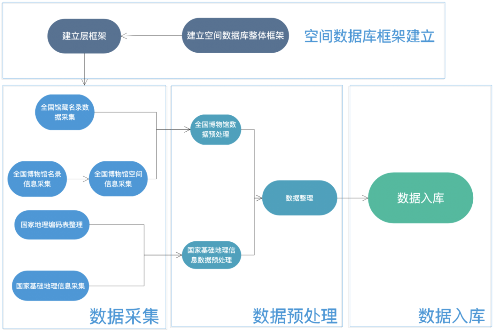

### 背景
文物博物馆管理工作的基本操作流程主要包括:藏品来源、移交入馆、馆内清理、入库、库内整理等诸多环节。在这个过程中，由于博物馆中藏品数量巨大，藏品的规格、大小也各不相同，在这种情况下，如果只依靠人工的管理 方式，将难以全面准确地对藏品进行管理，任何疏漏都可能导致严重的后果， 造成文物和藏品的损失。

所以，现在我国大部分博物馆都建立起了数据库，但是大部分博物馆都有适合自己地域或地方特色的藏品管理方式。而要在这个管理规定的基础上再建 立产品的数字化管理系统，就难以保证我国博物馆管理行业内的管理方式统一 化。差异化的数据库标准和不同管理模式的侧重性，都为不同博物馆间数据共 享和管理平台的统一带来了困难。每一个管理系统的个体，都有极强的针对性 和差异性，只适用于单一博物馆，系统平台的通用性较差。并且，由于经费、 政治等因素，大部分的博物馆数据库都比较缺乏维护，如果拥有一个统一标准 的、规范的博物馆数据库，并应用于全国的博物馆的管理当中，充分发挥数字 化管理的效能，全面促进博物馆信息化资源共享的实现，实现更好的服务。

目前，我国的博物馆与空间数据相关联系还比较少，然而博物馆与空间数据息息相关，例如:1文物出入库的流动信息与空间数据相关，如果没有一个比较规范的记录，容易造成文物的流失;2我国博物馆常常是一个地区文化、 历史的见证，具有较高的参观、旅游价值，所以将博物馆与地理信息相联系， 方便用户更快查询博物馆，可为更多参观者、研究人员提供服务。

### 系统目的和任务
该系统的目的是建立全国博物馆的空间数据库，旨在为公众提供全国各地 博物馆的信息查询与空间分析功能以及为博物馆研究人员提供较为完善的数据 分析查询平台支持。系统主要任务如下:

1. 收集整理全国博物馆基本信息及其地理空间信息   
2. 收集整理博物馆馆藏文物信息
3. 收集整理全国基础地理数据（行政区划及道路、水系要素等）

系统支持如下功能：
1. 博物馆信息查询功能
如查询某地的博物馆分布情况、查询博物馆信息、查询各类型博物馆藏品的空间分布情况等

2. 博物馆空间分析功能
如区域博物馆分布密度分析、查询某一位置点一定缓冲区内的博物馆情况、博物馆旅游规划功能等

### 技术细节（整理...）

总体入库框架

### 建设成果（应用）
#### 博物馆数据空间查询

博物馆空间查询

#### 博物馆空间分析

博物馆空间分布密度估计

全国瓷器藏品空间分布

...

#### 地域文物文本挖掘
按地级市聚合统计其包含的文物，对文物名称进行中文分词和词频统计，生成各个地级市的文
物词频图，示例如：

洛阳市文物词频图

绍兴市文物词频图

#### 其它
暂略

## 参考资料
1. [百度博物馆地图](https://baike.baidu.com/museum)
2. [国家文物局综合行政管理平台](http://gl.sach.gov.cn/sachhome/index.html)
3. [全国文物馆藏名录](http://gl.sach.gov.cn/collection-of-cultural-relics/index.html)
4. [中国国家博物馆简介](http://www.chnmuseum.cn/gbgk/gbjj/)
5. 文物博物馆管理中的问题及措施研究 肖仁杰
6. 博物馆藏品的数字化管理 付森
