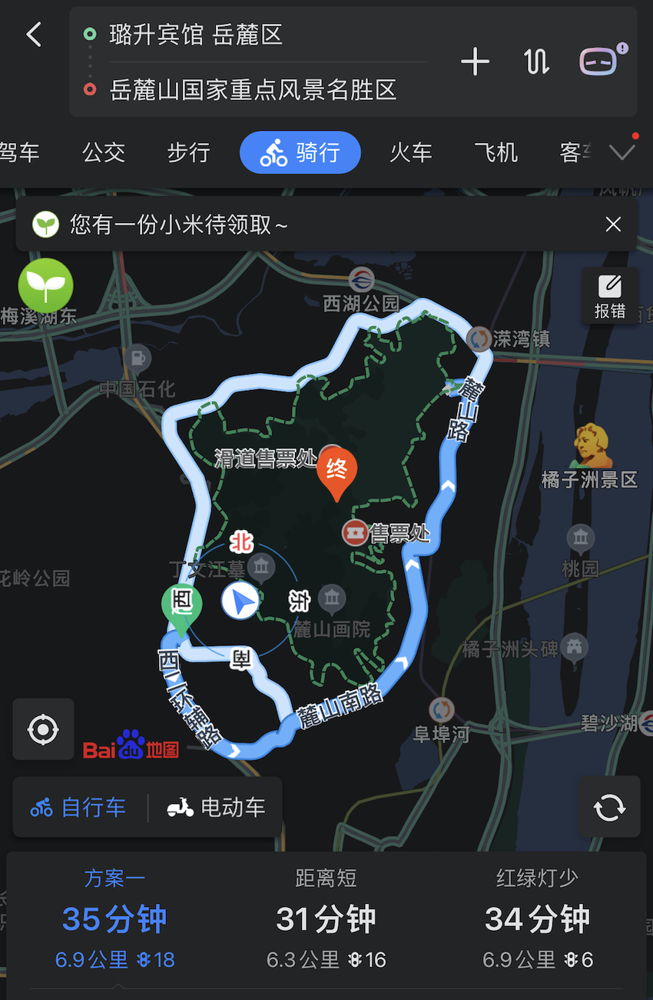
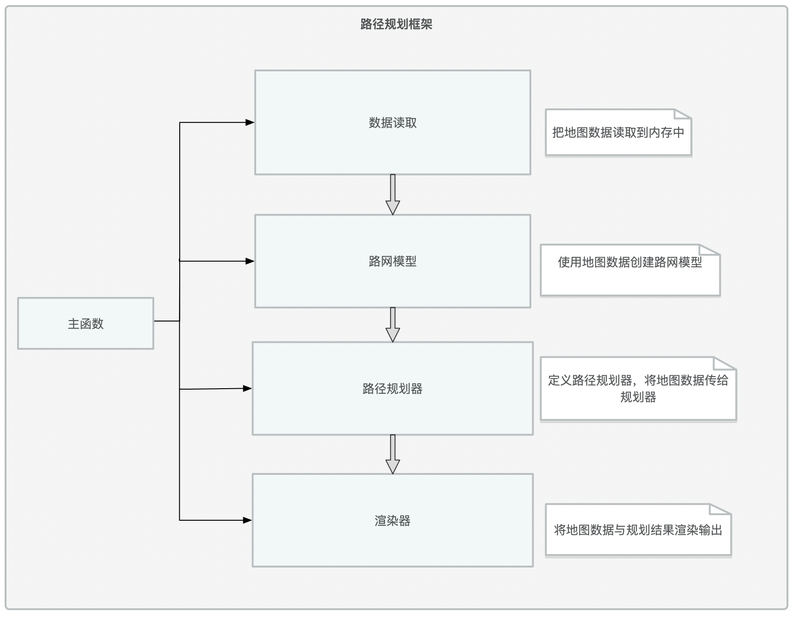
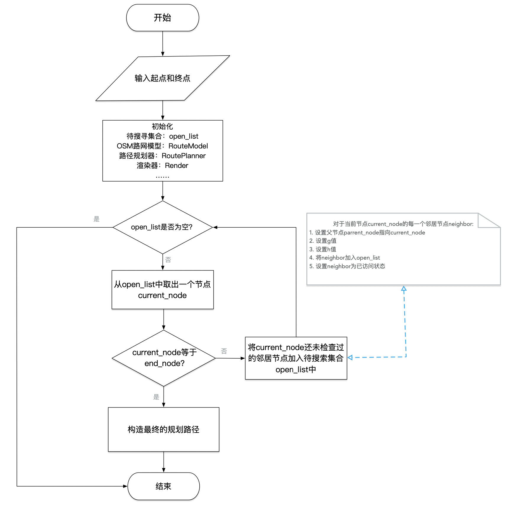
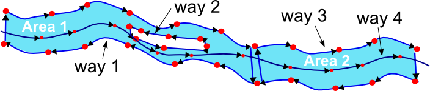
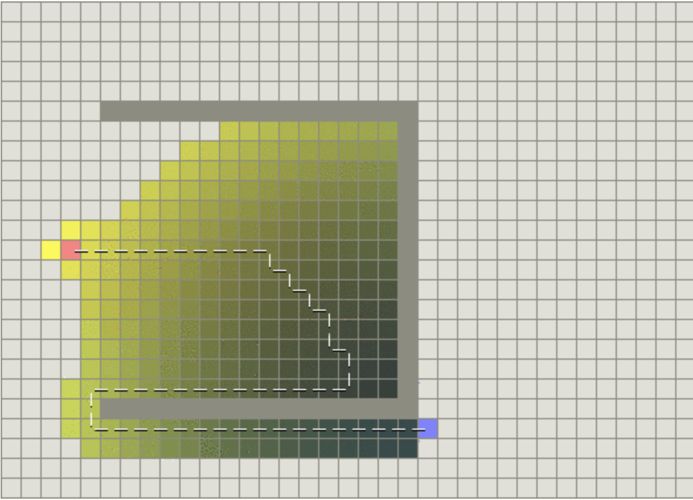

## 0x00 背景介绍
路径规划是运动规划中的一个主要问题，在很多领域中都有应用，高新领域有如机器人运动、无人机飞行、巡航导弹运动等；日常生活有如出行导航、路网规划等。在不同的场景中有不同的目标和约束，规划的方案会有所不同，也可能不止一个。比如说我们使用百度地图/高德地图等软件的导航功能时，软件返回的方案会包括时间最短、距离最短、红绿灯最少等方案，根据骑行、步行、自驾小汽车、公交等出行方式的不同又会有不同的方案（如下图），有时我们可能还要求所规划的路线必须经过某些指定地点。所以说路径规划本身的问题可以是非常复杂的，因为现实就是很复杂。

 

本项目以练手和规划算法学习为目标，以日常生活场景中的出行导航路径规划为例，搭建一个基本的路径规划框架，这个框架满足：
1. 基于真实地图数据（OpenStreetMap数据）
2. 内置路径规划算法（A*算法）
3. 可对规划结果进行可视化

## 0x01 项目方案
### 总体框架
总体上分为四大模块：数据读取、路网模型构建、路径规划器构建与数据渲染。


### 代码结构
#### src目录
包含如下文件：
- main.cpp
- model.h、model.cpp
- render.h、render.cpp
- route_model.h、route_model.cpp
- route_planner.h、route_planner.cpp

##### main.cpp
main.cpp控制着程序的流程，完成四个主要任务：
- 将OSM数据读取到内存/程序中

- 将OSM数据组织成一个便于使用的数据结构：RouteModel

- 基于RouteModel创建一个路径规划器RoutePlanner，本项目中该规划器会对模型数据进行A*搜索，并将搜索结果存储在RouteModel中。也可以实现其他的规划器，实现不同的规划算法。

- 基于IO2D库渲染RouteModel中数据

##### model.h和model.cpp
model.h和model.cpp文件来自于[IO2D的示例代码](https://github.com/cpp-io2d/P0267_RefImpl/tree/master/P0267_RefImpl/Samples/maps)。其定义的是地图模型中地理要素的基本数据结构（Node、Way、Polygon、RoadWay及其他OSM对象中更抽象的基类）。

##### route_model.h和route_model.cpp
这些文件包含的类用于使用派生类RouteModel和RouteModel::Node来扩展model.h和model.cpp中的Model和Node数据结构。派生的RouteModel和RouteModel::Node类使用Model类和Node结构的所有公共方法和属性。

之所以要扩展现有的Model类和Node结构，是为了包含便于具体的路径搜索算法（如A*搜索）执行的有用的辅助方法和变量。以A\*搜索算法为例，其派生路网模型现在允许节点类RouteModel::Node存储以下属性：
- h值,
- g值,
- 一个布尔变量用于表示节点是否被访问过,
- 一个集合用以存储邻居节点

以下方法：
- 寻找该节点的邻居节点,
- 计算该节点与其他某一节点的距离,

RouteModel类存储以下方法：
- 计算路网中距离坐标(x,y)最近的节点
- 创建路网中节点到对应路段的哈希表映射

##### route_planner.h和route_planner.cpp
定义RoutePlanner类和A*搜索的方法。

##### render.h和render.cpp
render.h 和 render.cpp文件接收存储在RouteModel对象中的地图数据和规划好的路径数据，并将这些数据渲染成地图。

#### thirdparty目录
包括项目所引用的第三方代码：如用于测试的googletest框架、用于解析xml文件的pugixml。

#### test目录
测试用例。

### 算法执行流程
A*算法执行流程：


### 项目测试
基于GoogleTest实现单元测试。

## 0x02 原理详解
### OpenStreetMap
OpenStreetMap项目是一个开源、合作的项目，其目的是创建免费的、以用户众源的方式生成的世界地图。这些地图类似于你可能在谷歌地图或手机上的苹果地图应用中使用的地图，但其数据完全是由自愿对当地环境进行调查的用户/志愿者所上传的。

#### 数据格式
OpenStreetMap数据可以有几种不同的格式。这个项目使用的数据是以OSM XML文件（.osm文件）的形式出现的，可以在OSM官网下载，这里给出示例如下：
```xml
<?xml version="1.0" encoding="UTF-8"?>
<osm version="0.6" generator="CGImap 0.8.2 (28085 thorn-03.openstreetmap.org)" copyright="OpenStreetMap and contributors" attribution="http://www.openstreetmap.org/copyright" license="http://opendatacommons.org/licenses/odbl/1-0/">
 <bounds minlat="22.5168000" minlon="114.0571000" maxlat="22.5476000" maxlon="114.0903000"/>
 <node id="72569111" visible="true" version="3" changeset="19091642" timestamp="2013-11-24T14:34:35Z" user="MarsmanRom" uid="44514" lat="22.5266580" lon="114.1131088"/>
 <node id="72571146" visible="true" version="2" changeset="740345" timestamp="2009-01-05T05:32:13Z" user="bdp" uid="53479" lat="22.5362824" lon="114.0948307">
  <tag k="created_by" v="Merkaartor 0.12"/>
 </node>
 <node id="2042231114" visible="true" version="3" changeset="58976325" timestamp="2018-05-15T08:55:33Z" user="tommydragon" uid="2620510" lat="22.5474104" lon="114.0811521">
  <tag k="amenity" v="cafe"/>
  <tag k="name" v="星巴克"/>
  <tag k="name:en" v="Starbucks"/>
  <tag k="name:zh" v="Starbucks"/>
 </node>
 <node id="2044316560" visible="true" version="5" changeset="81436528" timestamp="2020-02-25T05:59:27Z" user="XD346" uid="4892967" lat="22.5375519" lon="114.0559922">
  <tag k="highway" v="traffic_signals"/>
  <tag k="traffic_signals" v="signal"/>
 </node>
 ……
 <way id="40988675" visible="true" version="8" changeset="81611422" timestamp="2020-02-29T02:03:07Z" user="XD346" uid="4892967">
  <nd ref="2751405339"/>
  <nd ref="2751394450"/>
  …
  <nd ref="7252052352"/>
  <nd ref="7252052353"/>
  <nd ref="6935534196"/>
  <tag k="highway" v="service"/>
 </way>
 <way id="40998252" visible="true" version="5" changeset="64133651" timestamp="2018-11-03T06:25:24Z" user="XD346" uid="4892967">
  <nd ref="499681264"/>
  <nd ref="499681270"/>
  <tag k="bridge" v="yes"/>
  <tag k="highway" v="secondary"/>
  <tag k="lanes" v="3"/>
  <tag k="layer" v="1"/>
  <tag k="name" v="金田路"/>
  <tag k="name:en" v="Jintian Road"/>
  <tag k="name:zh" v="金田路"/>
  <tag k="oneway" v="yes"/>
 </way>
 <relation id="7713584" visible="true" version="6" changeset="73745047" timestamp="2019-08-26T10:42:52Z" user="Claudius Henrichs" uid="18069">
  <member type="node" ref="6745828846" role=""/>
  <member type="node" ref="6673766134" role="stop"/>
  <member type="node" ref="1689954793" role="stop"/>
  <member type="node" ref="5356142053" role=""/>
  <tag k="name" v="白石洲"/>
  <tag k="name:en" v="Baishizhou"/>
  <tag k="network" v="深圳地铁1号线"/>
  <tag k="operator" v="深圳地铁集团第一运营分公司"/>
  <tag k="public_transport" v="stop_area"/>
  <tag k="type" v="public_transport"/>
 </relation>
 <relation id="7713586" visible="true" version="4" changeset="73745047" timestamp="2019-08-26T10:42:52Z" user="Claudius Henrichs" uid="18069">
  <member type="node" ref="6745828845" role=""/>
  <member type="node" ref="6673766135" role="stop"/>
  <member type="node" ref="5214588591" role="stop"/>
  <member type="node" ref="2458958754" role=""/>
  <member type="node" ref="2458958755" role=""/>
  <member type="node" ref="2458954969" role=""/>
  <member type="node" ref="2458958714" role=""/>
  <member type="node" ref="2698410776" role=""/>
  <member type="node" ref="6520453282" role=""/>
  <tag k="name" v="世界之窗"/>
  <tag k="name:en" v="Window of the World"/>
  <tag k="public_transport" v="stop_area"/>
  <tag k="type" v="public_transport"/>
 </relation>
 <relation id="7913936" visible="true" version="1" changeset="55558915" timestamp="2018-01-18T19:33:01Z" user="Claudius Henrichs" uid="18069">
  <member type="relation" ref="7913935" role=""/>
  <member type="relation" ref="2287554" role=""/>
  <tag k="colour" v="#00AB39"/>
  <tag k="name" v="1号线 Line 1（罗宝线 Luobao Line）"/>
  <tag k="name:en" v="Line 1 (Luobao Line)"/>
  <tag k="name:zh" v="1号线（罗宝线）"/>
  <tag k="network" v="深圳地铁"/>
  <tag k="operator" v="深圳市地铁集团有限公司"/>
  <tag k="ref" v="1"/>
  <tag k="route_master" v="subway"/>
  <tag k="type" v="route_master"/>
  <tag k="wikidata" v="Q842103"/>
  <tag k="wikipedia" v="zh:深圳地铁1号线"/>
 </relation>
 ……
</osm>
```

#### 数据类型
主要有三种类型的要素：Node、Way、Relation
##### Node（节点）
[节点](https://wiki.openstreetmap.org/wiki/Node)是OpenStreetMap数据模型中最基本的元素之一。每个节点表示一个单点，有一个标识符id、纬度lat和经度lon。节点元素中还有其他的XML属性，比如用户ID和节点被添加到数据集的时间戳。一个节点可以有多个标签（tag），用于提供额外的信息。

##### Way（路径）
[路径](https://wiki.openstreetmap.org/wiki/Way)是一个有序的节点列表，代表地图中的一个线状地理要素，如道路、公园边界等。每条路至少有一个标签，表示该路的一些信息，每条路也至少属于一个Relation（关系）。路可能是开放的（首节点与末节点不同）也可能是闭合成环的（首节点与末节点为同一节点）。

##### Relation（关系）
[关系](https://wiki.openstreetmap.org/wiki/Relation)是一种数据结构，它记录了数据元素之间的关系，由一个或多个标签和一个由一个或多个节点、路径或关系作为成员的有序列表组成，用于定义地理元素之间的逻辑或地理关系。OpenStreetMap wiki中的「关系」例子包括：
- 路线关系，包括主要公路、自行车路线和公共汽车路线等路线。
- 多角形，描述一个带孔洞的区域，该区域的外边界和内边界由两种方式给出。

##### 示例
参考OSM wiki的一个[例子](https://wiki.openstreetmap.org/wiki/Tag:waterway%3Driverbank): 如何绘制/记录一条河的地图？

河的两边有不同的河岸。在下面的图片中，节点被用来提供沿河两岸的控制点的坐标。然后使用路径将多个节点连接起来；一些路径构成了河流的封闭部分，在下图中被标记为 "Area"。另一种方式是用来表示河流中间的岛屿。然后用一个关系将这些方式分组，代表整个河流。


可想而知，如果要构建公交路线规划系统，那么可以使用Node模型表示公交站，以Way模型表示由一些（代表性）控制点形成的道路，由Relation模型表示由一系列道路/路径所形成的路线。

### 路径规划算法
数据结构与算法基础课程中经典的最短路径求解算法如[Dijkstra算法](https://zh.wikipedia.org/wiki/戴克斯特拉算法)，虽然能够保证一定能够找到最短路径，但具有复杂度过高的致命缺陷，在大型的路网中几乎无法进行规划工作。所以如何改进路径规划算法的现实应用价值，使之既有较高的运行效率优化又不失准确性，便成为了一个老大难的问题。

#### 启发式路径规划：Greedy-Best-First-Search
[启发式算法](https://zh.wikipedia.org/wiki/启发式搜索)在很多实际问题中都有不错的表现：在合理时间内求得效果良好的解。在路径规划问题中自然也有人尝试这种思路。
一种比较简单的思路便是：Greedy Best First Search（这里将其简称为GBFS）。

Dijkstra算法在从当前节点向外探索的过程中，尽量选择离起点最近的节点作为下一步探索的点，搜索最短路径的整个过程可以总结为：**徐图渐进，稳中求胜**。Dijkstra算法最后一定能找到最短路径。（除非是Dijkstra处理不了的图，如边具有负权重）

而GBFS算法则采用了相反的思路，每次都以所能达到的离目的地更近的节点作为下一步探索目标，搜索路径的整个过程可以总结为：**凌厉欺近，不留余地**。GBFS算法是不一定保证能够找到最短路径的。

什么情况下GBFS算法不能找到最短路径？什么时候能找到？

最理想的情况下，地图/路网是无障碍物，此时凌厉欺近对方无可抵挡，一击可期必中。但是现实情况下地图/路网是复杂的，即便是游戏世界的地图也有很多地形起伏、障碍约束，此时通过GBFS搜索，很可能会在快到达终点时遇上过不去的坎，如下图：


#### A*搜索算法：权衡
[A\*算法](https://zh.wikipedia.org/wiki/A*搜尋演算法)是Dijsktra和GBFS的一种折中，其通过启发式的方式提高算法效率，且保证能寻找到一条较优的路径。

既然Dijsktra太猥琐，GBFS太莽撞，那么干脆将当前节点到目的地与到起点的距离/所需代价都考虑上，设计一条既可以提高效率又不至于做无用功的搜索策略。

记g(n)为从起点到节点n所需代价；h(n)为从节点n到终点的所需代价。A\*搜索算法在每次搜索时选择使得f(n)=h(n)+g(n)最小的节点。可见，极端情况下当h(n)为0，则只有g(n)对搜索过程起作用，此时A\*算法退化成Dijsktra算法，并且保证能够找到一条最短路径；当g(n)为0时，只有h(n)起作用，A\*退化成GBFS算法，不保证能找到最短路径。我们既然选择了A\*，就意味着我们已经认同了一个观点：*我们只需要一条“好”的路径，而不是一条“完美”的路径*。所以设计A\*算法中的一个关键问题是：如何设计启发式函数h(n)、权衡速度与精度以达到在合理时间内获得可接受的规划结果？

##### 启发式函数选择
启发式函数度量的是代价：从某一节点到运动到另一节点所需要耗费的资源或经历的路程。
以距离度量为例，常见的距离度量包括：
- 曼哈顿距离
- 对角距离
- 欧式距离
- 多种（距离）约束的集成

##### 估计误差的影响
A\*算法和GBFS算法中有一个重要组件：度量当前节点到目的地的代价。这实际上是一个估计，而不是有一个上帝视角告诉你当前节点距离终点的真实代价。实际上也正是因为信息不完全我们才需要设计一系列的策略来搜索从起始点到目的地的最短路径。

既然从当前节点到终点的真实代价不清楚，那么谁（代价函数）的估计与真实情况更吻合，算法就会工作得更好。经典的GBFS算法正是因为采用的启发式函数（欧式距离或曼哈顿距离度量）没能把障碍物（物理约束）所造成的“绕路成本”考虑在内而效果不好，这就是“错误”的启发所带来的副作用。

##### 尺度问题
A\*算法会依据总的启发值选择下一个探索的节点：f(n)=h(n)+g(n)。需要保证h(n)和g(n)在同一尺度，否则A\*将会高估或者低估g或h之一，导致你得不到好的路径或者以极长的运行时间得到接近完美的路径。

##### A*算法实现关键
- 一个集合容器用于存储待搜索节点
如果当前节点不是终点，那么需要将该节点周围的一些还没搜索过且值得在日后搜索的节点加入到容器中

- 计算节点的启发式值
g值和h值

- 对待搜索节点按f值排序
用于确定下一步应该检查哪个节点。如何使排序过程更高效又是一个问题，可以考虑使用优先队列。

##### A*算法改进思路
1. 预计算启发式值
  - 提前计算每对节点之间的最短路径
  - 提前计算地图上一些具有代表性的节点之间的最短路径
2. 改进待搜索列表的更新策略
  - Beam Search
  - Bandwidth Search
  - Bidirectional Search
  - ……

## 0x03 项目扩展思路
- 实现多种图数据源的融合
  - 在线地图
  - 简单格网地图
  - ……

- 实现地图交互

- 集成更多路径规划算法

## 0x04 相关资源
### A*算法及其改进思路
#### 关于A*算法
- [A*搜索算法 Wiki](https://zh.wikipedia.org/zh-hans/A*搜尋演算法)

- [Introduction to A*](http://theory.stanford.edu/~amitp/GameProgramming/AStarComparison.html)

- [Amit’s A* Pages](http://theory.stanford.edu/~amitp/GameProgramming/)

- [Don’t follow the shortest path!](http://realtimecollisiondetection.net/blog/?p=56)

- [Path planning with modified A star algorithm for a mobile robot](http://localhost:1313/project/osm-route-planning/pdf/Path-planning-with-modified-A-star-algorithm-for-a-mobile-robot.pdf)

- [Front-to-End Bidirectional Heuristic Search with Near-Optimal Node Expansions](https://www.ijcai.org/Proceedings/2017/69)

- [Yet another bidirectional algorithm for shortest paths](http://localhost:1313/project/osm-route-planning/pdf/Yet-another-bidirectional-algorithm-for-shortest-paths.pdf)

#### A*改进思路
- [Empowering A ∗ Search Algorithms with Neural Networks for Personalized Route Recommendation](https://dl.acm.org/doi/abs/10.1145/3292500.3330824)
### 地图表示
- [Map representations](http://theory.stanford.edu/~amitp/GameProgramming/MapRepresentations.html#waypoints)

