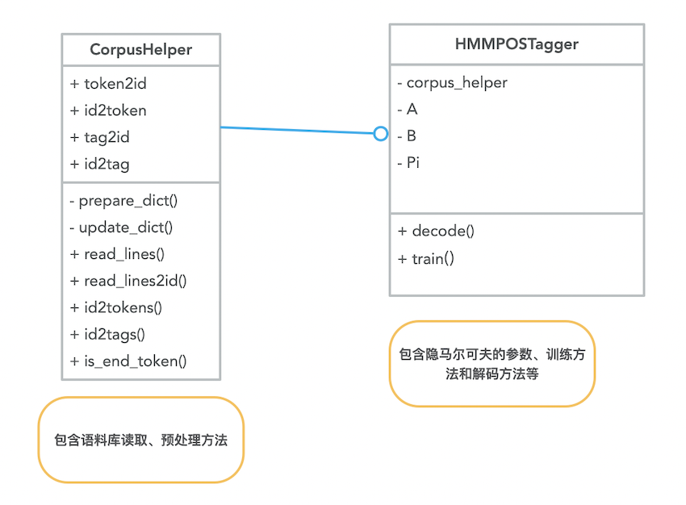
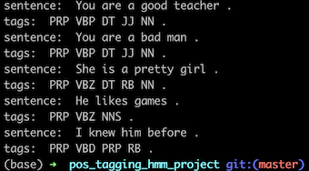

## 前言
本项目基于隐马尔可夫模型实现一个简易的词性标注器。首先简单介绍下面几个问题：
- 词性标注器是做什么的？
- 如何实现词性标注？
- HMM模型的思想

### 词性标注
#### 什么是词性？
词性是词汇的基本语法属性，也称为词类。词性标注（Part-Of-Speech tagging）就是在给定句子中判定每个词的语法属性，确定其词性并加以标注。语文课上或者英语课上老师让同学们分析句子成分，其中就会用到词性的信息，比如说主语只能是名词、代词等等，谓语只能是动词、助动词、系动词等等……了解词汇、句子的语法特征在某些场合下有助于我们理解句意（更多介绍请移步语法书），所以词性标注是一个值得研究的问题。

#### 如何实现词性标注？
那么如何实现词性标注？首先要知道词性标注面临着什么问题：
1. 词具有兼类现象

    同一个词可能有多种词性，尤其是对于汉语来说，词语在词性方面的歧义数量极大。

2. 词性划分具有主观性

    语言学界对于词性的划分没有统一被广泛认可的划分标准。

实现词性标注的方法可以分为以下几类：基于统计、基于规则、规则与统计融合的方法。
基于统计的方法若按照是否有标注数据来分又可以分为有监督和无监督的方法.

### 基于隐马尔可夫模型进行词性标注

#### 隐马尔可夫模型简要介绍
隐马尔可夫模型（HMM）建模的是不可观测隐状态变量、可观测的变量及其转化关系的概率分布。HMM属于概率图模型的一类，属于生成模型。根据训练数据是否包括观测序列对应的状态序列可以分为有监督学习和无监督学习的方法。

HMM认为在我们所能够观测到的变量背后实际上有一个隐含的状态变量，是这个隐含的变量决定了我们所能够观测到的现象，比如说我们看到了一串数字“6 5 1 3 4 2 1 2 5”，这串数字可能是由一个或多个骰子共投掷了9次所得到。所以要是能够把这个隐含变量的概率分布建模出来，那得到的模型就更能反应真实系统的工作机制。

隐马尔可夫模型有两个基本假设：
1. 齐次马尔可夫性假设

即认为隐马尔可夫链在t时刻的状态只依赖于t-1时刻的状态，这背后的意思是认为t-1时刻的状态已经包含了足够预测t时刻状态的历史状态信息。如只通过今天的天气预测明天的天气而不去理会昨天、前天甚至更早以前的天气。

2. 观测独立性假设

任意时刻的观测只依赖于该时刻马尔可夫链的状态。

隐马尔可夫模型主要有三大问题：
1. 概率计算：
给定状态转移概率、发射概率和初始概率，计算出现某观测序列的概率值

2. 学习问题：
已知观测序列和状态集合，估计HMM的参数：状态转移矩阵、发射矩阵和初始概率

3. 预测问题（解码问题）：
给定观测序列和HMM的参数，求出最有可能的隐状态序列。

#### 为什么能用HMM模型进行词性分析？
词性分析的过程中，我们所能够观测到的就是词汇的序列，要分析词性是不能直接观测到的，可以把句子各单词的词性与HMM中的隐状态对应起来，观测到的单词与显状态对应起来，然后就能够通过HMM的框架建模单词与词性的关系了。

#### 如何用HMM模型实现词性分析？
##### 明确变量和参数
要清楚HMM有什么样的变量和参数。
- 隐状态：词性
- 显状态：词汇
- 初始概率：句首词性的概率分布
- 状态转移矩阵A：从一个词性到下一个词性的概率分布
- 发射概率矩阵B：给定词性下词汇的概率分布

##### 明确如何学习参数
此处以有监督的方式训练，可以直接通过统计算出:

- 转移概率: $A[i][j]=\frac{N_{ij}}{N_i}$,

- 发射概率: $B[i][v]=\frac{N_{iv}}{N_i}$,

- 初始概率: $Pi\[i\]=\frac{N_{oi}}{N_o}$

##### 明确如何进行推断
给定句子，求出最可能的词性标注序列。使用维特比算法。

#### 基于HMM模型的词性分析器有何缺点？
HMM的假设很简洁，也能够在一些简单场景下工作得很好，但成也简洁，败也简洁。所做的两个假设对于真实情况下的复杂语言现象而言还是过分简单了：t位置的词性不止受t-1位置的词性的影响，可能还受更前面的，甚至后面的词性的影响；词汇的词性本身可能存在歧义；……

## 项目结构

### 测试结果

### 更多扩展
- 对于未登录词和分词，该如何处理？
- 如何实现无监督的词性标注？

    如利用EM算法的Baum-Welch算法

## 相关资料
### 教材
- 统计学习方法第10章：隐马尔可夫模型
- 统计自然语言处理第7章：自动分词、命名实体识别和词性标注

### 开源库
- [hmmlearn](https://hmmlearn.readthedocs.io/en/latest/)

### 博客：
- [Forward-可能是最易懂且全面的隐马尔可夫介绍（一）](https://zhuanlan.zhihu.com/p/113136120)
