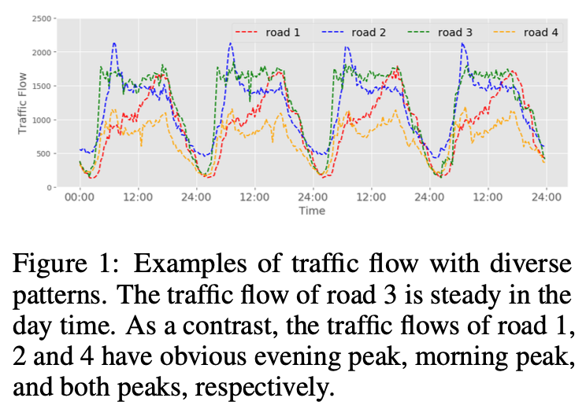

快速的城市化使城市人口不断增加，并为人口流动性和发展可持续性带来了巨大挑战。在这些挑战中，智能交通系统(ITS)已经成为一个活跃的研究领域[1]，因为它具有促进系统效率和决策的潜力。作为智能交通系统的重要步骤，交通预测旨在预测城市交通系统的未来状态（如交通流量和速度，以及乘客需求）。它在交通调度和管理中起着至关重要的作用，近年来引起了机器学习研究界的极大关注[2，3，4，5，6]。

由于不同来源的交通流量和交通速度预测的不同环形检测器/交叉口，以及乘客需求预测的不同车站/地区，产生了复杂的内部依赖关系(即一个交通序列中的时间相关性)和相互依赖关系(即多个相关交通序列之间的空间相关性)[3]，因此交通预测具有挑战性。传统的方法只是简单地部署时间序列模型，如将自回归综合移动平均(ARIMA)和向量自回归(VAR)用于交通预测。这些方法无法捕捉大规模交通数据中的非线性关联性和复杂的时空模式。最近，研究人员转向基于深度学习的方法，并专注于设计新的神经网络架构，以捕获所有交通序列共享的突出时空模式。他们通常用循环神经网络[7，8，9，10]（如长短时记忆和门控循环单元）或时空卷积模块[3，4]来模拟时空相关性。关于空间相关性，他们通常使用基于GCN的方法[2，4，3，6，11，5，12]来模拟非结构化的交通序列及其相互依赖性。

虽然最近基于深度学习的方法取得了可喜的成果，但它们偏重于所有交通序列中突出的和共享的模式--共享的参数空间使得目前的方法在准确捕捉细粒度的数据源特定模式方面存在不足。事实上，交通序列呈现出多样化的模式(如图 1 所示)，它们在不同的数据源中可能出现相似、不同甚至矛盾的属性[7, 13]。此外，现有的基于 GCN 的方法需要通过相似度或距离度量[14]来预先定义一个互连图，以捕获空间相关性。这进一步要求大量的领域知识，并且对图的质量很敏感。这种方式生成的图通常是直观的、不完整的，并不直接针对预测任务，在没有相应知识的情况下，可能会存在偏差，不能适应领域。

与其设计更复杂的网络架构，我们提出了两种简洁而有效的机制，通过修改当前方法的基本构件（即GCN）来分别解决上述问题。具体来说，我们提出在GCN中加入两个自适应模块来增强流量预测任务。1）节点自适应参数学习（NAPL）模块，用于学习每个交通系列的节点特定模式--NAPL将传统GCN中的参数进行因子化，并根据节点嵌入情况从所有节点共享的权重池和偏置池中生成节点特定参数；2）数据自适应图形生成（DAGG）模块，用于从数据中推断节点嵌入（属性），并在训练时生成图形。NAPL和DAGG是独立的，可以单独或联合适应现有的基于GCN的交通预测模型。模块中的所有参数都可以很容易地以端到端的方式进行学习。此外，我们将NAPL和DAGG与循环网络相结合，提出了一个统一的交通预测模型--自适应图卷积循环网络（AGCRN）。AGCRN可以捕捉交通序列中细粒度的节点特异性空间和时间相关性，并将修正后的GCNs中的节点嵌入与DAGG中的嵌入统一起来。因此，训练AGCRN可以为每个交通序列源（例如，交通速度/流量的道路，乘客需求的车站/区域）提供有意义的节点表示向量。学习到的节点表示包含了关于道路/区域的有价值的信息，并有可能应用于其他任务[15]。

我们在两个真实世界的数据集上对AGCRN进行了多步骤交通预测任务的评估，并与几个有代表性的交通预测模型进行了比较。实验结果表明，AGCRN以显著的优势优于最先进的技术。我们还进行了消融研究，并证明了NAPL和DAGG的有效性。

### 讨论
多变量/相关时间序列预测是许多应用的基本任务，如流行病传播预测[42]、气象学（如空气质量、降雨量）预测[43]、股票预测[44]和销售预测[45]。虽然我们的工作是以交通预测任务为动机，但所提出的两个自适应模块和我们的AGCRN模型也可以单独或联合适应各种多变量/相关时间序列预测任务。

从数据中自动发现不同相关序列之间的相互依赖关系是可能的，这一发现弥补了基于图的预测模型与一般相关时间序列预测问题难以预定义图关系的鸿沟。我们未来的工作将着重从两个角度研究我们工作的可扩展性。1）数据角度--在更多的时间序列预测任务上验证AGCRN的性能；2）模型角度--将NAPL和DAGG适配到更多基于GCN的交通预测模型上。

### 结论
本文提出在传统图卷积网络的基础上，分别加入节点自适应参数学习和数据自适应图生成模块，用于学习节点特定模式和从数据中发现空间相关性。在这两个模块的基础上，我们进一步提出了自适应图卷积循环网络，该网络可以在没有预设图的情况下，自动捕捉时间序列数据中节点特定的空间和时间相关性。在多步骤交通预测任务上的大量实验证明了AGCRN和所提出的自适应模块的有效性。该工作揭示了将基于GCN的模型应用于相关时间序列预测中，通过推断数据的相互依赖性，并揭示了学习节点特定模式对于理解相关时间序列数据至关重要。

### 影响
总的来说，这项工作可以实现更准确的交通预测，为出租车调度和路线规划等更高层次的交通调度提供便利。通过这种方式，我们的工作可以帮助旅客节省时间，为交通运营商提高效率和收入，并节省能源消耗。从广义上讲，在大数据时代的社会和商业广泛应用的相关时间序列分析中，自适应性是可取的。所提出的自适应模块可以使基于动态的、相互依赖的、时间序列数据的数据分析和相关应用的鲁棒性得到提升。该研究总体上支持对基于复杂的显性和隐性关联的图结构的多通道数据进行更好的建模和分析。它对解决许多依赖复杂时间序列数据的世界范围的经济和社会问题，如流感爆发、经济增长和气候变化的预测，具有影响，并有可能加快研究进度。这项工作可能带来的负面影响是打车平台的公平问题。在出租车供给不能保证需求的情况下，平台可能会过于强调预测的高需求区域，这将增加低需求区域旅客的等待时间。

