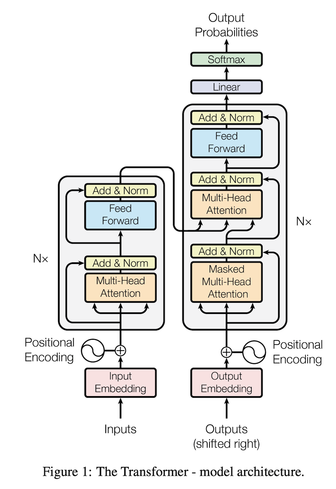
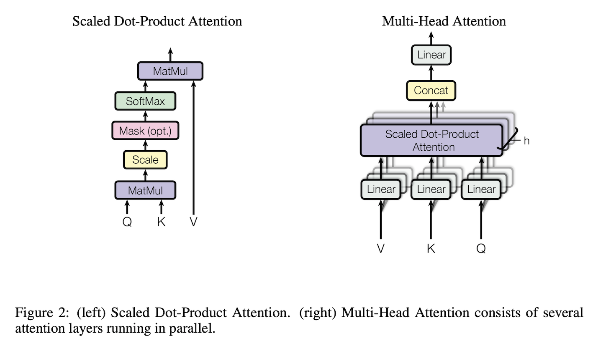

### 引言
循环神经网络，特别是长短期记忆[12]和门控循环[7]神经网络，已经被牢固地确立为语言建模和机器翻译等序列建模和转换问题的最先进方法[29，2，5]。此后，大量的努力继续推动循环语言模型和编码器-解码器架构的边界[31，21，13]。

循环模型通常沿着输入和输出序列的符号位置进行因子计算。这种固有的顺序性使得我们无法训练实例中的并行化，这在较长的序列长度上变得至关重要，因为内存约束限制了跨实例的批处理。最近的工作通过因子化技巧[18]和条件计算[26]实现了计算效率的显著提高，同时也提高了后者情况下的模型性能。然而，顺序计算的基本约束仍然存在。

注意力机制已经成为各种任务中引人注目的序列建模和推导模型的一个组成部分，允许对依赖关系进行建模，而不考虑它们在输入或输出序列中的距离[2，16]。然而，除少数情况外[22]，这种注意机制是与循环网络一起使用的。

在这项工作中，我们提出了Transformer，一个摒弃递归的模型架构，而完全依靠注意力机制来绘制输入和输出之间的全局依赖关系。Transformer允许更多的并行化，并且在8个P100 GPU上训练12小时后，就可以在翻译质量上达到一个新的水平。

### 背景

减少顺序计算的目标也构成了扩展神经GPU[20]、ByteNet[15]和ConvS2S[8]的基础，它们都使用卷积神经网络作为基本构件，对所有输入和输出位置并行计算隐藏表示。在这些模型中，将两个任意输入或输出位置的信号关联起来所需的运算次数随着位置之间的距离而增长，对于ConvS2S来说是线性的，对于ByteNet来说是对数的。这使得学习遥远位置之间的依赖关系变得更加困难[11]。在Transformer中，这种情况被减少到了恒定的操作次数，尽管代价是由于注意力加权位置的平均化而降低了有效的分辨率，我们用多头注意力来抵消这种效果，如3.2节所述。

自注意力，有时也被称为内注意，是一种将单一序列的不同位置联系起来以计算序列表征的注意机制。自注意力已被成功地用于各种任务中，包括阅读理解、抽象总结、文本内涵和学习与任务无关的句子表征[4，22，23，19]。

端到端记忆网络是基于循环注意机制而不是序列排列的循环，已被证明在简单语言问题回答和语言建模任务中表现良好[28]。

然而，据我们所知，Transformer是第一个完全依靠自注意力来计算其输入和输出的表示，而不使用序列对齐的RNNs或卷积的转导模型。在下面的章节中，我们将描述Transformer，激励自注意力，并讨论其与[14，15]和[8]等模型相比的优势。

### 模型架构

### 结论
在这项工作中，我们提出了Transformer，这是第一个完全基于注意力的序列转换模型，用多头自注意力取代了编码器-解码器架构中最常用的循环层。

对于翻译任务，Transformer的训练速度可以显著快于基于循环层或卷积层的架构。在WMT 2014英译德和WMT 2014英译法两个翻译任务上，我们实现了新的技术状态。在前一个任务中，我们的最佳模型甚至超过了之前报道的所有合集。

我们对基于注意力的模型的未来感到兴奋，并计划将其应用于其他任务。我们计划将Transformer扩展到涉及文本以外的输入和输出模式的问题，并研究局部的、受限的注意力机制，以有效地处理图像、音频和视频等大型输入和输出。让生成的顺序性降低是我们的另一个研究目标。