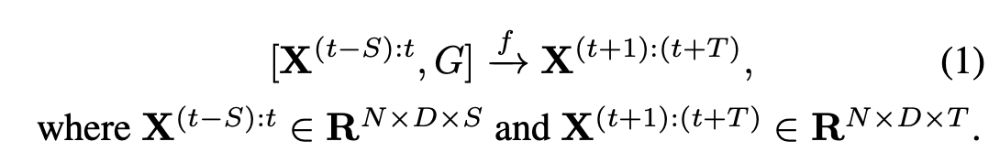
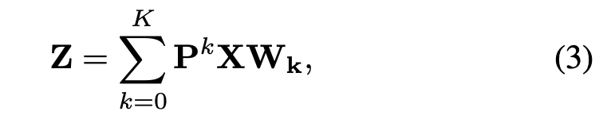
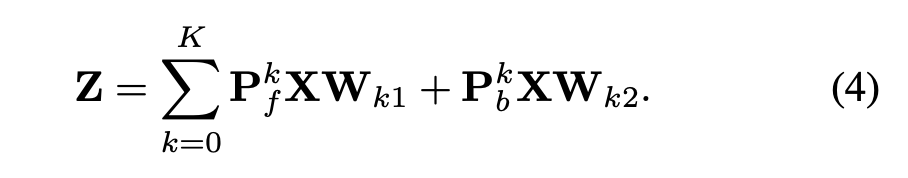
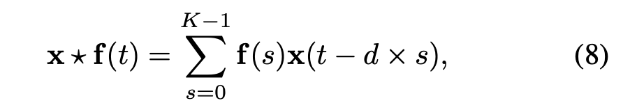
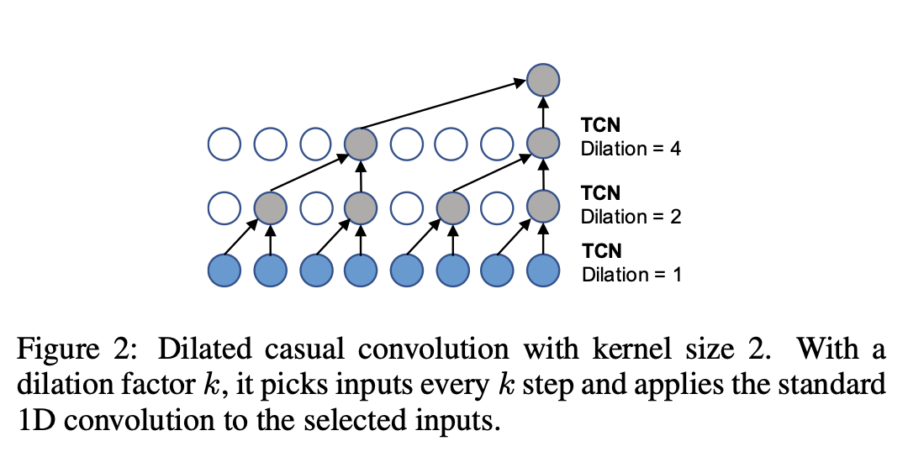
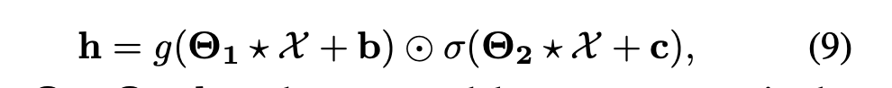
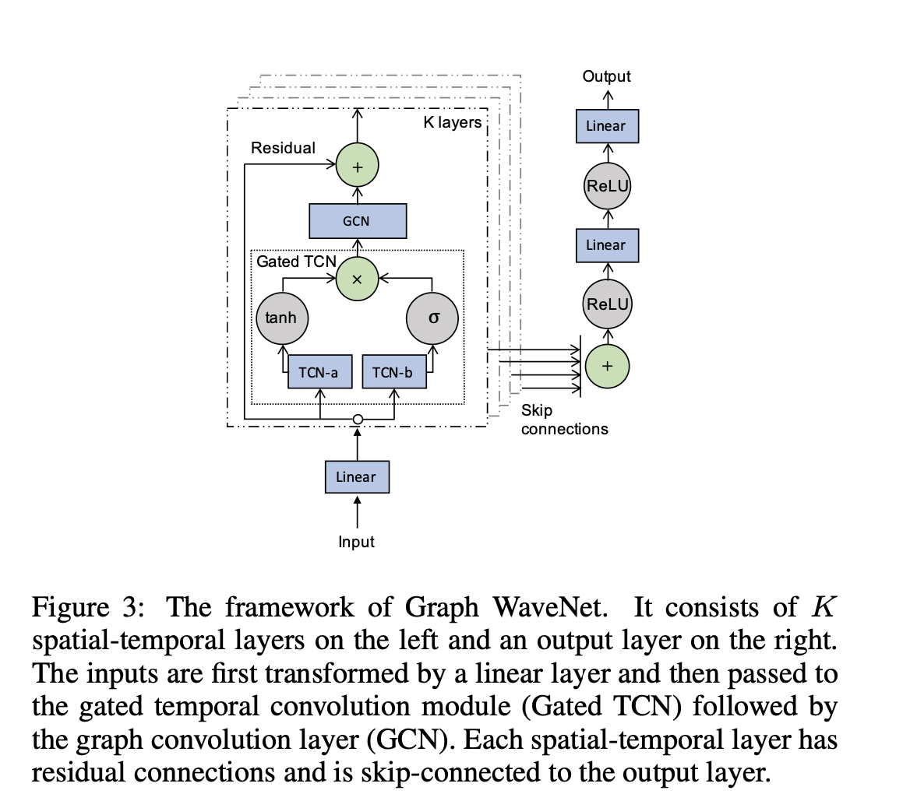
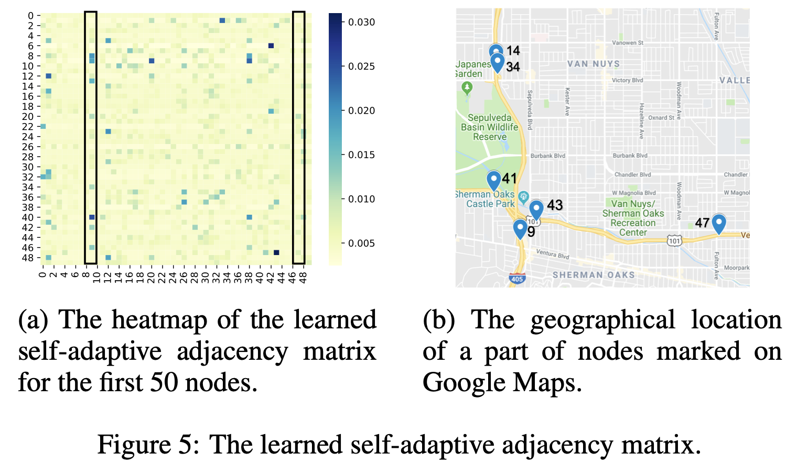
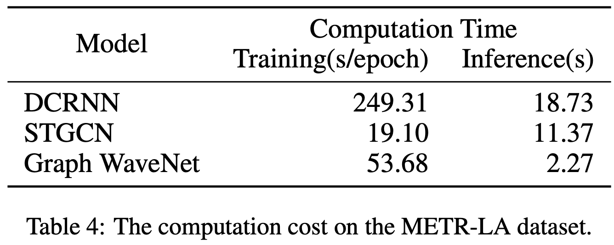

## 文章内容
### 引言
随着图神经网络的发展，时空图建模越来越受到重视。它的目的是通过假设连接节点之间的相互依赖性，对动态节点级输入进行建模，如图1所示。时空图建模在解决复杂的系统问题中有着广泛的应用，如交通速度预测[Li等，2018b]、出租车需求预测[Yao等，2018]、人类动作识别 ，以及驾驶员操纵预测[Jain等，2016]。举个具体的例子，在交通速度预测中，城市道路上的速度传感器形成一个图，边缘权重由两个节点的欧氏距离来判断。由于某条道路的交通拥堵会导致其进站道路的交通速度降低，因此，在对各条道路的交通速度时间序列数据进行建模时，自然要考虑交通系统的底层图结构，作为节点之间相互依赖关系的先行知识。

时空图建模背后的一个基本假设是，一个节点的未来信息是以其历史信息以及邻居的历史信息为条件的。因此，*如何同时捕捉空间和时间上的依赖性成为一个主要的挑战*。最近关于时空图建模的研究主要遵循两个方向。他们要么将图卷积网络（GCN）集成到循环神经网络（RNN）中[Seo等，2018；Li等，2018b]，要么将其集成到卷积神经网络（CNN）中[Yu等，2018；Yan等，2018]。虽然已经证明了将数据的图结构引入模型的有效性，但这些方法面临着两大不足。

首先，这些研究假设数据的图结构反映了节点之间真正的依赖关系。然而，*在有些情况下，连接并不包含两个节点之间的相互依赖关系，而两个节点之间的相互依赖关系存在的情况下连接却可能缺失*。为了给每种情况举个例子，我们来考虑一个推荐系统。在第一种情况下，两个用户是连接在一起的，但他们可能对产品有不同的偏好。在第二种情况下，两个用户可能有相似的偏好，但他们没有联系在一起。Zhang等人[2018]使用关注机制通过调整两个连接节点之间的依赖权重来解决第一种情况，但他们没有考虑第二种情况。

其次，目前针对空间-时间图建模的研究对于学习时间依赖性是无效的。基于RNN的方法在捕捉长范围序列时存在耗时的迭代推进和梯度爆炸/消失的问题[Seo等，2018；Li等，2018b；Zhang等，2018]。相反，基于CNN的方法享有并行计算、稳定的梯度和低内存要求的优势[Yu等，2018；Yan等，2018]。然而，这些工作需要使用许多层来捕获非常长的序列，因为它们采用标准的1D卷积，其接受场大小随着隐藏层数的增加而线性增长。

在这项工作中，我们提出了一种基于CNN的方法，命名为Graph WaveNet，它解决了我们前面提到的两个缺点。我们提出了一个图卷积层，其中自适应邻接矩阵可以通过端到端的监督训练从数据中学习。通过这种方式，自适应邻接矩阵保留了隐藏的空间依赖性。受WaveNet[Oord et al.，2016]的启发，我们采用堆叠扩张的随意卷积来捕捉时间依赖性。随着隐藏层数的增加，堆叠式稀释随意卷积网络的接受场大小呈指数级增长。在堆叠式扩张随意卷积的支持下，Graph WaveNet能够有效地处理具有长距离时间序列的空间-时间图形数据。该工作的主要贡献如下：

- 我们构建了一个自适应的邻接矩阵，它能保留隐藏的空间依赖性。我们提出的自适应邻接矩阵能够在没有任何先验知识的指导下从数据中自动发现未被发现的图结构。实验验证了我们的方法能够改善已知存在但未提供空间依赖关系时的结果。

- 我们提出了一个有效且高效的框架来同时捕捉空间-时间依赖性。其核心思想是将我们提出的图卷积与扩张的随意卷积进行组合，使每个图卷积层在不同的粒度层次上处理扩张的随意卷积层所提取的节点信息的空间依赖性。

- 我们在交通数据集上评估了我们提出的模型，并以较低的计算成本实现了最先进的结果。Graph WaveNet的源代码可从https://github.com/nnzhan/Graph-WaveNet公开获得。

### 相关工作
#### 图卷积网络
图卷积网络是学习图结构数据的构件[Wu等，2019]。它们被广泛应用于节点嵌入[Pan等，2018]、 节点分类[Kipf和Welling，2017]、图分类[Ying等，2018]、链路预测[Zhang和Chen，2018]和节点聚类[Wang等，2017]等领域。图卷积网络有两种主流，基于频域的方法和基于空间的方法。基于频域的方法使用图谱滤波器平滑节点的输入信号[Bruna等，2014；Defferrard等，2016；Kipf和Welling，2017]。基于空间的方法通过聚合邻域的特征信息来提取节点的高层表示[Atwood和Towsley，2016；Gilmer等人，2017；Hamilton等人，2017]。在这些方法中，邻接矩阵被认为是先验知识，并且在整个训练过程中是固定的。Monti等人[2017]通过高斯核来学习节点邻居的权重。Velickovic等人[2017]通过注意力机制更新节点邻居的权重。Liu等[2019]提出了一种自适应路径层来探索节点邻居的广度和深度。虽然这些方法假设每个邻居对中心节点的贡献是不同的，需要学习，但它们仍然依赖于预先定义的图结构。Li等人[2018a]采用距离度量来自适应学习图的邻接矩阵，用于图分类问题。这个生成的邻接矩阵是以节点的输入为条件的。由于时空图的输入是动态的，他们的方法对于时空图建模是不稳定的。

#### 时空图网络
大多数时空图网络遵循两个方向，即基于RNN和基于CNN的方法。其中早期基于RNN的方法通过过滤输入和隐藏状态传递给一个循环单元，使用图卷积来捕获时空依赖性[Seo等，2018]。后来的工作采用了不同的策略，如扩散卷积[Li等，2018b]和注意力机制[Zhang等，2018]来提高模型性能。另一项并行工作使用节点级RNNs和边缘级RNNs来处理不同方面的时间信息[Jain等，2016]。基于RNN的方法的主要缺点是，对于长序列来说，它的效率变得很低，而且当它们与图卷积网络相结合时，其梯度更容易爆炸。基于CNN的方法将图卷积与标准的1D卷积相结合[Yu等，2018；Yan等，2018]。虽然计算效率高，但这两种方法必须堆叠许多层或使用全局池化来扩展神经网络模型的接受场。

### 方法
在本节中，我们首先给出本文所要解决的问题的数学定义。接下来，我们描述了我们框架的两个构件，即图卷积层（GCN）和时间卷积层（TCN）。它们一起工作以捕获空间-时间的依赖性。最后，我们概述了我们框架的架构。

#### 问题定义
图用G=(V，E)表示，其中V是节点的集合，E是边的集合。

#### 图卷积层
图卷积是鉴于其结构信息提取节点特征的基本操作。Kipf等人[2017]提出了切比雪夫谱滤波器的一阶近似[Defferrard等，2016]。从基于空间的角度来看，它通过聚合和变换节点的邻域信息来平滑节点的信号。他们的方法的优点是：它是一个组合层，其滤波器在空间上是局部的，并且支持多维输入。
以$\hat{A}\in R^{N\times N}$表示带自循环的归一化邻接矩阵，$X∈R^{N×D}$表示输入信号 ，$Z∈R^{N×M}$表示输出，$W∈R^{D×M}$表示模型参数矩阵，在[Kipf和Welling，2017]中，图卷积层定义为：

Li等[2018b]提出了一种扩散卷积层，证明其在时空建模中是有效的。他们用K个有限步长对图信号的扩散过程进行建模。我们将其扩散卷积层概括为式3的形式，结果为:

其中Pk表示转移矩阵的幂序。在无向图的情况下，P=A/rowsum(A)。在有向图的情况下，扩散过程有两个方向，即前向和后向，其中前向转移矩阵$P_f=A/rowsum(A)$，后向过渡矩阵$P_b=A^T/rowsum(A^T)$。有了前向和后向转移矩阵，扩散图卷积层写为:

#### 时间卷积层
我们采用稀释的因果卷积[Yu和Koltun，2016]作为我们的时间卷积层（TCN）来捕捉节点的时间趋势。稀释的因果卷积网络通过增加层深，可以实现指数级的大接收场。相对于基于RNN的方法，稀释的随意卷积网络能够以非递归的方式正确处理长距离序列，有利于并行计算，缓解梯度爆炸问题。稀疏因果卷积通过给输入填充零来保留时间上的因果顺序，这样在当前时间步上做出的预测只涉及历史信息。作为标准1D-卷积的一种特殊情况，稀释的因果卷积操作通过跳过具有一定步长的值在输入上滑动，如图2所示。数学上，给定一个1D序列输入x∈RT和一个滤波器f∈RK，x与f在第t步时的稀释因果卷积运算表示为：

其中d是控制跳转距离的扩张因子。通过以越来越大的顺序堆叠扩张因子的扩张因果卷积层，模型的接受场呈指数级增长。它使稀释的因果卷积网络能够用较少的层数捕获较长的序列，从而节省计算资源。

门控TCN：门控机制在循环神经网络中至关重要。它们已经被证明是强大的控制信息流通过层的时间卷积网络以及[Dauphin等人，2017]。一个简单的Gated TCN只包含一个输出门。给定输入X∈RN×D×S，它的形式是

其中Θ1、Θ2、b、c为模型参数，⊙为
元素乘积，g(-)是输出的激活函数，σ(-)是决定传递给下一层信息比例的sigmoid函数。我们在模型中采用Gated TCN来学习复杂的时间依赖性。虽然我们根据经验设置了正切双曲函数作为激活函数g(-)，但Gated TCN的其他形式可以很容易地装入我们的框架中，例如类似LSTM的Gated TCN[Kalchbrenner等，2016]。

#### Graph WaveNet框架

### 实验

#### 自适应邻接矩阵的效应
为了验证我们提出的自适应邻接矩阵的有效性，我们使用五种不同的邻接矩阵配置对Graph WaveNet进行实验。表3显示了12个预测范围内MAE、RMSE和MAPE的平均得分。我们发现，仅有自适应模型比仅有前向模型的平均MAE效果更好。当图结构不可用时，Graph WaveNet仍能实现良好的性能。前向-后向自适应模型在三个评价指标上的得分都是最低的。这说明如果给定图结构信息，加入自适应邻接矩阵可以为模型引入新的有用信息。在图5中，我们进一步研究了在METR-LA数据集上训练的前向-后向自适应模型配置下学习的自适应邻接矩阵。根据图5a，有些列有更多的数据。高值点比其他点如左框第9栏 与右框中的第47列相比。这说明有些节点对图中的大多数节点有影响，而其他节点的影响较弱。图5b证实了我们的观察。可以看出，节点9位于几条主干道的交叉口附近，而节点47位于一条道路上。
### 结论
在本文中，我们提出了一种新型的时空图模型。我们的模型通过将图卷积与扩张的随意卷积相结合，有效地捕捉空间-时间依赖性。我们提出了一种有效的方法来从数据中自动学习隐藏的空间依赖性。这为时空图建模开辟了一个新的方向，在这个方向上，系统的依赖性结构是未知的，但需要被发现。在两个公共交通网络数据集上，Graph WaveNet实现了最先进的结果。在未来的工作中，我们将研究在大规模数据集上应用Graph WaveNet的可扩展方法，并探索学习动态空间依赖关系的方法。