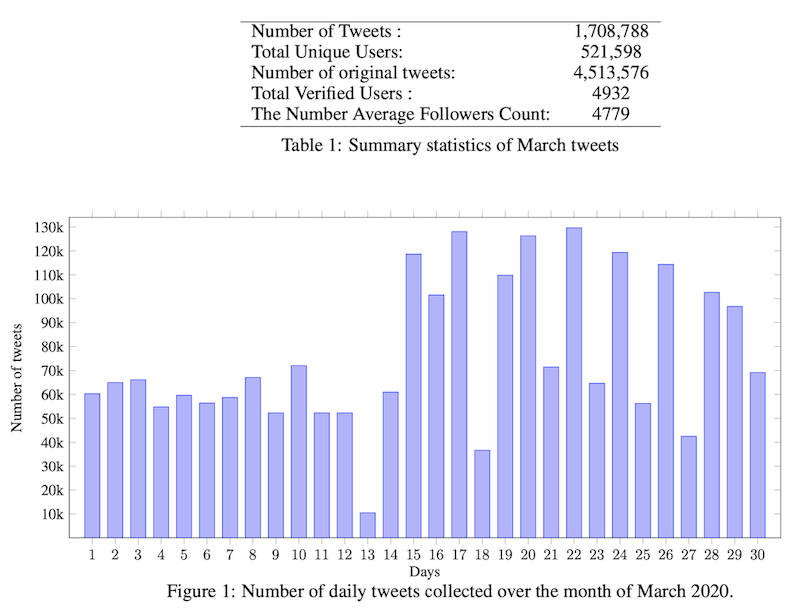
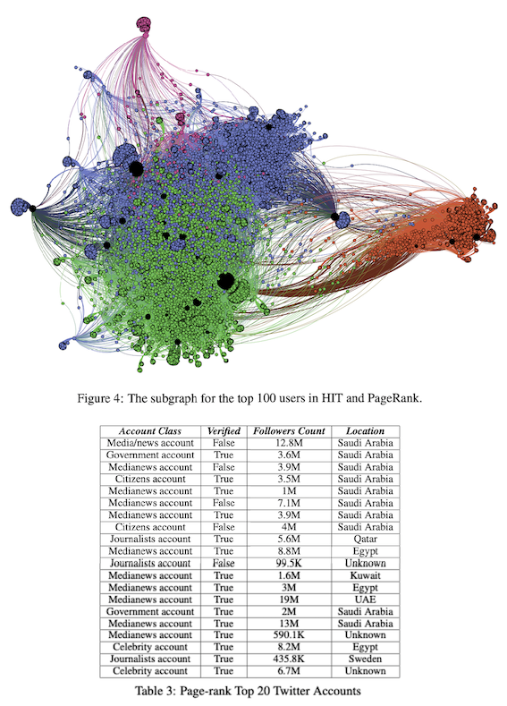
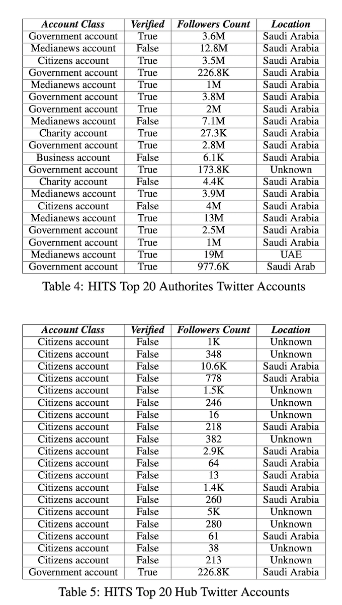

## 文章内容
### 引言
新型冠状病毒(COVID-19)给人类带来巨大挑战。首例新型冠状病毒(SARS-CoV-2)确诊病例于2019年12月在中国武汉市确诊。由于冠状病毒的高传播速度，全球已经有超过1000万确诊病例。自那以后，卫生官员迅速查明并遏制COVID-19的传播，与此同时，社交媒体平台上遭遇了前所未有的信息泛滥。 由于疾病的影响，以及缺乏与疾病相关的持续性官方验证信息，医疗误导信息在不同的社交媒体平台上迅速传播和扩散。在社交媒体上传播的有关COVID-19大流行的信息会强烈影响人们的行为，影响政府和卫生官员为控制病毒而制定的措施的实施效果。近年来，研究者的兴趣已经转移到关注是否可以通过特定的个人（通常被称为 "影响者 "或超级传播者）最大限度地扩大某一主题的信息传播。有影响力的人具有区别于其他人的特征，比如专业知识或连接性。这些特点使他们能够影响他们网络中的许多人。社交媒体上的影响者(或超级传播者)可能助长有关COVID-19大流行的错误信息的传播。因此，在COVID-19大流行期间识别他们对理解公众反应和信息传播有重要意义。

Twitter平台非常适合研究COVID-19期间影响者的作用。Twitter每月有超过3亿的活跃用户[4]，可以直接访问数量空前的内容，其中一些内容可能会夸大谣言和可疑信息。Twitter包括各种类型的用户，他们通过tweet与关注者进行同样的交流。Twitter的另一个独特之处是能够向大众传播帖子。因此，可以通过Twitter上明显的活动来衡量和比较个人的影响力。此外，它可以根据用户的位置、时间、年龄、性别和/或语言区分用户和帖子，尽管一些用户的信息可能是私人的或丢失的。推特的特点使得研究人员能够专注于研究和探索Twitter网络中特定的兴趣模式。

本文研究了在阿拉伯语Twitter上寻找COVID-19信息超级传播者的问题，并应用两种用于网页排名的排名算法HITS和PageRank[5,6]，对用户的影响力进行排名。我们将重点放在分析用户之间的动态交互，在这些交互中，转发、回复、提及和引用等操作都被表示出来并考虑在内。简而言之，我们分析了一个大型有向加权图，其中节点代表twitter用户，边代表twitter中发生的动态交互。

本文的其余部分组织如下。在下一节中，我们将概述相关工作。第3节介绍影响者分析中常用的算法。第4节详细说明了我们的实验。我们将在第5节讨论关于超级传播者的分析结果。

### 相关工作

Twitter在全球拥有超过3.3亿的月活跃用户，平均每天产生数亿条推文[7]。通过用户之间的互动，每天在Twitter上发布的信息流速度之快令人印象深刻。Twitter的用户数量庞大，但找到最有影响力的用户是大有裨益的。寻找有影响力的用户并对其进行排名，最常见的算法是PageRank和HITS算法[5，6]，它们最早的提出是用来衡量网页在互联网上的重要性的。这两种算法都被广泛应用于Twitter社交网络[8]。PageRank算法是一种广泛使用的影响度量方法。PageRank算法是一种应用广泛的影响力衡量方法。Kwak等人[9]根据关注者数量和PageRank对用户进行排名，从而评估Twitter上有影响力的用户。但是，他们忽略了用户在Twitter网络中的传播影响。Tunkelang[10]提出了TunkRank算法，它是PageRank对Twitter的适应。TunkRank算法强烈依赖于用户之间的关注关系。该算法根据用户能从他/她的追随者那里获得多少关注，以及追随者从自己的追随者网络中给用户带来多少关注，来定义影响力得分。影响力得分是对最终会阅读某个用户文章的读者的数值估计。在对PageRank的扩展中，Weng等人[11]提出了TwitterRank，既考虑了用户之间的话题相似度，又考虑了社交网络的关注结构。在TwitterRank中，由于一个Twitter用户可以对很多不同的话题感兴趣，因此在不同的话题中，用户影响力是不同的。Huang和Xiong[12]提出的U-R模型基于PageRank算法对用户影响力进行评估。用户在关注网络中的影响力可通过U-R值进行排序。Yang等[13]提出了针对Twitter社交网络的HITS算法的改进版本，该算法可以应用在用户图（User Graph）和Tweet Graph上，并具有转发和跟随者-被跟随者的关系。但是，单纯的跟帖社交网络并不能反映用户与其他用户互动时获得的影响力。用户的互动和推文对于识别最有影响力的用户和展示信息传播中的影响力值具有重要意义。因此，很多研究都是利用PageRank和HITS算法，根据用户的交互作用来识别有影响力的用户[14,15,16,17]。

Twitter已经成为研究新型冠状病毒期间各种话题的丰富数据来源。许多研究集中在了解大流行期间的一般行为。这通常取决于对社交媒体上帖子内容的分析。Abd-Alrazaq等人[18]利用潜在狄利克雷分配(LDA)话题建模技术确定了COVID-19大流行期间Twitter用户讨论的主要英语话题。利用词频技术unigram和bigram对推文进行分析。该工作将话题分为四类，分别是与病毒来源、病毒来源、病毒对人和国家的影响、减少病毒传播的方法等相关的话题。对确定的话题进行情感分析，只有两个话题具有负面情感，这两个话题分别是与COVID-19死亡和增加种族主义有关的话题。Saad等人利用Twitter数据调查了受冠状病毒大流行影响最严重国家的公众对COVID-19的认识。

为了研究各国对大流行的应对措施，作者确定了COVID-19趋势的时间模式。作者使用主题建模技术和情感分析来了解用户对这些措施的反应。结果显示，COVID-19病例较低的国家具有较高的信息流，从而有助于提高公众意识。Sha等人利用主题建模和网络分析，对决策者如何在Twitter上影响COVID-19进行了分析。有人为美国州长和总统内阁成员创建了一个社交网络，利用格兰杰因果关系确定了大流行期间最有影响力的政治家[21]。他们观察到州长们的影响力受州的大小影响。

随着社交媒体上关于COVID-19的谣言和错误信息的传播不断增加，很难获得准确的信息，这导致了更多的恐惧，阻碍了应对病毒的措施，因此，大部分的研究都集中在识别影响信息传播的影响者和研究信息流行的影响。Infodemic是 "信息 "和 "流行 "两个词的组合，通常表示关于某种疾病等准确和不准确信息的快速传播。
 
Escuredo和Tarazon[22]在COVID-19期间，基于中心性指标对一个由超过10k个节点和100k条边组成的非定向行为社交图谱进行了识别和排名。在网络的每个边缘都添加了流量属性，当添加一个已经退出网络的边缘时，流量会增加。该研究讨论了中心性指标之间的数据流的差异。
 
Ahmed等人[23]利用行为社会网络和中心性测量方法，通过识别传播这一错误信息的有影响力的用户，提出了将5G与推特上COVID-19的传播联系起来的阴谋论研究。作者确定了10个与阴谋相关的有影响力的账户，其中大部分传播阴谋的有影响力的用户是公民账户。笔者还找出了其中5个与5G和COVID-19阴谋相关的最具参考价值的网站。这些网站大部分都不是可信的来源。此外，他们还对推文内容进行了人工分析，以确定人们是否真的认为COVID和5G有关，只有一小部分用户相信阴谋。
 
Mourad等[24]研究了信息流对社交网络的影响，他们对twitter数据内容进行分析，利用自然语言处理(NLP)技术发现关于COVID-19的误导性推文，并确定推文的来源。对用户的资料进行分析，确定用户是否有医学专业。83%的用户没有医学专业。该研究描述了传播错误信息的危险影响，以及利用医学领域以外的影响者帮助向大量人群传播有关病毒的正确信息的重要性。

在[25]的研究中，提出了在广泛的社交媒体平台上对信息流行病的比较研究，这些平台是Twitter、Instagram、YouTube、Reddit和Gab。对这些平台的帖子和评论的内容进行了分析。笔者使用累积的帖子数量和每个帖子的反应数量来衡量COVID-19的互动和参与度。利用流行病模型对5个平台的信息传播进行了建模，分析了错误信息的传播情况。他们发现，可靠或可疑信息的传播并没有呈现明显的差异。

以前的研究大多集中在分析Twitter的英文内容上。在这项工作中，我们首次提供了从阿拉伯语推文中识别COVID-19信息影响者（例如，超级传播者）的分析。

### 推特社交网络
在过去的几年中，Twitter已经被作为实时向公众传达紧急情况[26]一个重要的工具。事实上，在紧急情况下，Twitter用户提供了详细的信息，警告他人远离危险情况，如疫情爆发和恶劣的天气状况，这有助于他人做出更好/更谨慎的决定。作为一个平台，Twitter可以在各种情况下快速、简洁地交换信息。Twitter允许用户发布被称为推文的帖子，限制为140个字符。对于什么是可接受的推文，没有任何规则或格式。此外，用户创建的帖子成为公开的，并且可以立即访问和提供给他们的社交网络中的其他人。与其他社交网络服务不同的是，Twitter不要求用户在其他用户看到他/她的帖子之前授予朋友接受。要关注Twitter上的对话，用户需要关注其他成员，他们的推特才会出现在他们的新闻源上。此外，Twitter用户在发布Tweet时，会收到来自社交网络其他成员的即时和自动反馈。因此，Twitter一直是研究人员测试兴趣、最新事件、用户态度以及识别群体中最具影响力的成员的目标平台。了解哪些个人因为其权威、地位或关系而有能力改变人们对特定主题的决定是至关重要的[27]。这些人被称为影响者。识别用户的影响力对许多领域都有帮助，例如市场营销[28]、政治科学[29]和谣言传播[8]。识别大流行期间的影响者对于了解公众反应和信息传播非常重要。

为了识别Twitter上的影响者，我们通过与他人的相互联系来寻找影响力，所以在评价用户的社会影响力时，自然要考虑后续和行为网络。Twitter社交网络通常用一个有向图G=(N，E)来表示，其中N是一组用户节点，E是一组有向边，表达/描述节点之间的连接方式。后续关系是Twitter社交网络最传统的表示方式。在后续图中，N是Twitter用户的集合，边表达了用户之间的后续关系。如一个边（A，B）∈E表示用户A是用户B的追随者，但由于行为网络是基于两个用户之间的动态交互，如回复、提及、引用、转发一条推文，这种动态交互可以用一组用户节点的有向图来表示，而边则代表用户之间的不同交互（如一个用户对不同用户发布的推文的转发）。后续网络代表账户之间潜在的信息流，而行为网络代表实际的信息流。因此，与后续网络相比，行为网络代表了账户之间更强的关系。这使得行为网络成为研究信息传播中影响者作用的理想选择。对于有影响力用户的检测和排名，基本上有两种著名的算法必须强调。因此，下面几小节将对这两种算法进行描述。

#### PageRank算法
Google搜索引擎早期阶段开发的一个著名算法是PageRank算法，用来确定一个页面的相关性或重要性[5]。该算法通过估计每个页面所含链接的质量和数量，给每个页面分配一个重要性和权威性的相对数字分数。该算法采用简单的迭代算法计算，并基于随机冲浪者模型，即网络的随机冲浪者从一个页面开始随机形成链接到达目标页面的概率。

为了分析twitter的社交图谱，本文考虑了每个用户的PageRank得分。假设有转发或回复用户V的推特等互动行为的用户列表U，U中每个用户的PageRank得分平均分配给用户V。例如，用户$U_i$的PageRank得分为X，它总共与5个用户的推特进行了互动。Ui的PageRank得分X将被发送给Ui互动过的每个用户。它可以用数学方式表示如下[5]。

其中，$PR(A)$为计算出的某用户节点A的PageRank，N对应于图中的节点总数。$P(A)$是指向节点A的节点集合，$P(U_i)$是节点A到节点$U_1,...,U_n$的外链数量。最后，参数d为阻尼系数，表示跳转到随机用户节点的概率，通常设置为0.85。

#### HITS算法
HITS算法是由Kleinberg[6]开发的一种网页排名算法。该算法基于权威机构和枢纽的思想，其中权威机构是指有较多传入链接的网页，枢纽是指有许多相关权威机构的传出链接的网页。如果一个页面指向了很多好的权威机构，那么这个页面就被认为是一个好的枢纽，一个好的权威页面被很多好的枢纽指向。与PageRank算法不同的是，HITS算法的起点是由与搜索查询相关的页面和任何链接到相关页面的页面组成的网络子集。至于Twitter行为社交图分析，我们将每个节点N视为用户节点，每个节点包含一组Hub得分Nh和Authority得分Na。给定S是指向N的节点集 ，而T是N指向的节点集 。 枢纽得分和权威得分的迭代计算过程如下。用户N的权威得分auth(N)是指向用户N的节点S的所有枢纽得分的归一化和。

用户N的枢纽得分hub(N )是T指向的所有节点的权威得分的归一化和。

### 实验
为了识别COVID-19大流行期间的阿拉伯语推特影响者，我们使用我们的大型阿拉伯语数据集[30]中的推文。该数据集包含从2020年1月1日至2020年4月30日的超过4514.36亿条推文。我们创建了一个与COVID-19相关的最常见的阿拉伯语关键词列表来收集推文。使用Twitter的流媒体API和Tweepy Python库，我们根据关键词列表对推文进行提取和过滤。我们在MongoDB NoSQL数据库中存储了推文的完整对象，包括推文的时间戳、推文的id、用户资料信息，包括关注者数量和推文的地理位置。流包含了一条tweet被转发的次数信息。转发次数由以 "RT @user "开头的推文识别。数据集还包含关于提及、回复和引用的信息，这些信息代表了Twitter上用户之间的公开对话[30]。然而，在我们的实验中，我们只考虑了3月份（2020年3月1日至2020年3月30日）检索的推文。我们选择3月是出于这样一个事实，即几乎所有阿拉伯语国家都在2020年3月初确认了他们的第一例COVID-19。表1显示了3月份推文的一些统计数字。这些推文的每日分布如图1所示。

#### 数据预处理
在我们创建网络之前，通过删除空值和只考虑必要的列来清理数据。我们的数据集中有超过170万条推文，其中一些推文是由同一个用户写的。因此，我们只包含唯一的用户。我们对数据集中的每一条推文进行分析，以提取在数据集中提及、转发、引用或回复推文的用户。通过探索数据库中的JSON字段、转发状态和引用状态，我们恢复了每条转发的源推文的用户id和每条引用的推文的用户id。我们通过探索JSON字段实体中嵌入的JSON字段提及来收录提及某条推文的用户。最后，从回复中的JSON字段中，我们提取了该条推文是回复的用户id。增加了转发者、提及者、引用者.回复者等字段。这些字段以数组的形式包含了与该推文互动的用户的id号。我们从用户资料中提取了用户的位置，并且我们删除了或禁用的账户。

### 结果与讨论
我们将账户分为两类：个人账户和组织账户。我们进一步将个人账户分为记者账户、名人账户和公民账户，组织账户分为媒体/新闻、政府、慈善或商业账户。组织账户被分为媒体/新闻、政府、慈善或商业账户.行为网络表达了一组更亲密的行动。我们的行为网络由不相连的组件组成，因为不是所有的节点都是相连的，只有6%的节点是强连接的。根据Smith等人[31]对Twitter网络结构的分类，我们的行为网络被认为是一个社区集群网络。这种类型的网络形成于一个热门话题，如我们案例中的COVID-19，围绕几个中心形成的多个小群体，每个群体都有其受众。鉴于我们的行为网络由近百万条边组成，当然不可能将其可视化。图3显示了与我们分析相关的不同参数的分布函数。y轴是数值小于或等于相应x轴值的点的分数。我们可以观察到，除了超级传播者节点的少数例外，其他节点的值都接近于零。

尽管如此，我们还是选择了一个子图，其中包含了HITs和PageRank中的Top-100超级传播者及其直接连接。这个子图，在图4中可视化，显示了不同的模块化等级，其中节点大小是根据加权indegree调整的。黑色的节点代表HITs或PageRank中Top-100超级传播者中的用户。

表3显示了根据PageRank算法排名的前20名用户的信息。许多账户拥有大量的关注者，但是，在我们的网络中，有一些账户的关注者数量要多得多。这说明排名前20的账户与他们的粉丝有更多的互动。
在我们的网络中，我们认为中心账户是一个经常与许多未连接的账户进行交互的用户，导致边缘指向远离中心节点，而权威账户是一个收到许多他人交互行为的用户，导致边缘指向权威。因此，可以认为权威账户比中心账户更有影响力。表4和表5分别显示了根据中枢和权威性得分进行排名的前20个屏幕名。SaudiMOH937账号是沙特阿拉伯卫生部的官方账号，根据权威性得分排名第四，根据中心得分排名第二十。这样的发现是合理的，因为SaudiMOH937账户播报的信息会收到很多他人的互动，也会通过Twitter提供帮助。

可以看到，无论是PageRank算法还是HITS算法的权威性得分，都显示出各自TOP20的用户子集相似，比例为50%。值得注意的是，两者的顺序有很大的不同，只有10%的用户在两种算法中的排名完全相同，而且前20名用户中有40%的用户拥有验证账号。

综上所述，从确定的HITS和Page Rank两种算法的前20名有影响力的阿拉伯文推特用户中，有19个组织账号；8个媒体/新闻账号，8个沙特政府账号，2个慈善账号，1个商业账号。此外，有7个个人账户均为男性；3个个人账户为记者账户，2个名人账户，2个公民账户。

如结果所示，大部分有影响力的账户是新闻账户，其次是沙特阿拉伯各部委的政府账户。其中有三个账号属于沙特阿拉伯卫生部，其次是记者、名人和公民。属于沙特阿拉伯卫生部的新闻和政府账号在3月份的阿拉伯文推特中，两种算法的影响力榜单上都名列前茅。这是由于3月份中东地区，特别是海湾地区出现了COVID-19的确诊病例。因此，人们转而向经过验证的新闻来源，如卫生部在Twitter上的账户，以获取有关COVID- 19的信息，这表明Twitter成为了疾病动态的重要新闻和信息来源。然而，并不是所有的新闻账户都是可靠的来源。50%的有影响力的账户位于沙特阿拉伯。这可以解释为沙特阿拉伯是世界上最大的积极使用Twitter的国家之一。统计数据显示，2019年10月，Twitter有1090万来自沙特阿拉伯的活跃用户[32]，沙特阿拉伯41%的互联网用户使用Twitter。此外，大部分被评为影响者的账号都是经过验证的Twitter上的知名账号，并且拥有大量来自阿拉伯世界各地的粉丝，这也证实了社交媒体的作用，为人们提供了更多的机会直接影响他人，这在以前是不可能的。因此，无论信息的质量和可信度如何，个人在通过Twitter传播信息方面发挥着重要作用。

除了识别有影响力的人，根据他们的影响力进行排名也是积极利用他们的影响力的重要手段。结果显示，两种排名算法都对推特上具有不同影响程度的不同群体进行了排名。同时也注意到，两种算法都将沙特卫生部的四个账号归为影响力账号。在影响者的Page Rank榜单中，沙特卫生部账号位居第二，排在第四位的是沙特卫生部长Tawfiq Al-Rabiah的账号。而在HITS算法中，有4个与健康相关的账号，排在首位的是沙特卫生部的账号，然后排在第三位的是沙特卫生部长Tawfiq Al-Rabiah的账号。卫生部937账号排名第四，卫生部发言人的账号在榜单中排在第十二位。

这说明社交媒体，尤其是Twitter在教育沙特个人和社会方面发挥了重要作用。然而，有可能出现的情况是，已经确定的一些群体中的影响者，如媒体/新闻、记者和名人，可能有助于传播关于COVID-19的虚假信息。我们希望信息超级阅读者利用其在社会平台上的影响力为社会谋求更大的利益。

### 结论
在社交媒体中识别信息超级传播者可以成为在大流行病期间提高意识的有效战略。使用可靠和值得信赖的超级传播者可以帮助减少关于疾病的错误信息的传播，并向更多的受众推广更好的健康实践。这项研究确定了2020年3月期间推特阿拉伯语内容中的影响者。然而，在这方面还需要进行更多的研究。一个潜在的工作是分析影响者在传播错误信息方面的作用，以及他们是否利用他们的影响力为社会带来更大的利益。另一条研究路线是分析Facebook和Instagram等其他社交平台上的信息超级传播者。在这方面，本研究中使用的方法可以用于其他社交平台，尽管互动方式不同。

