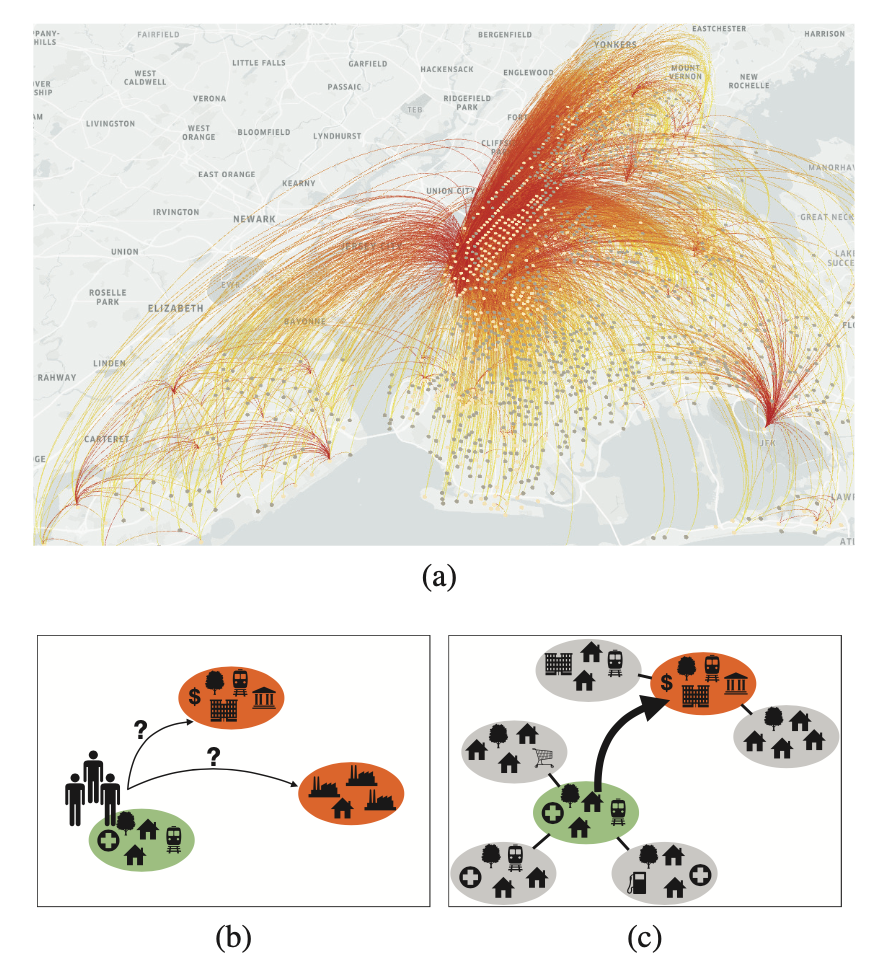
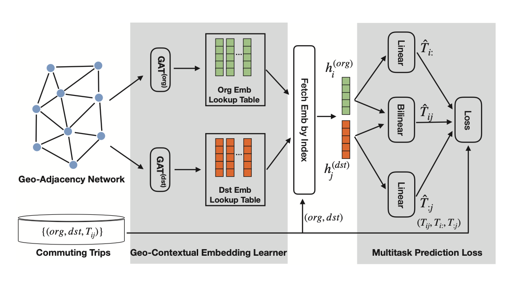
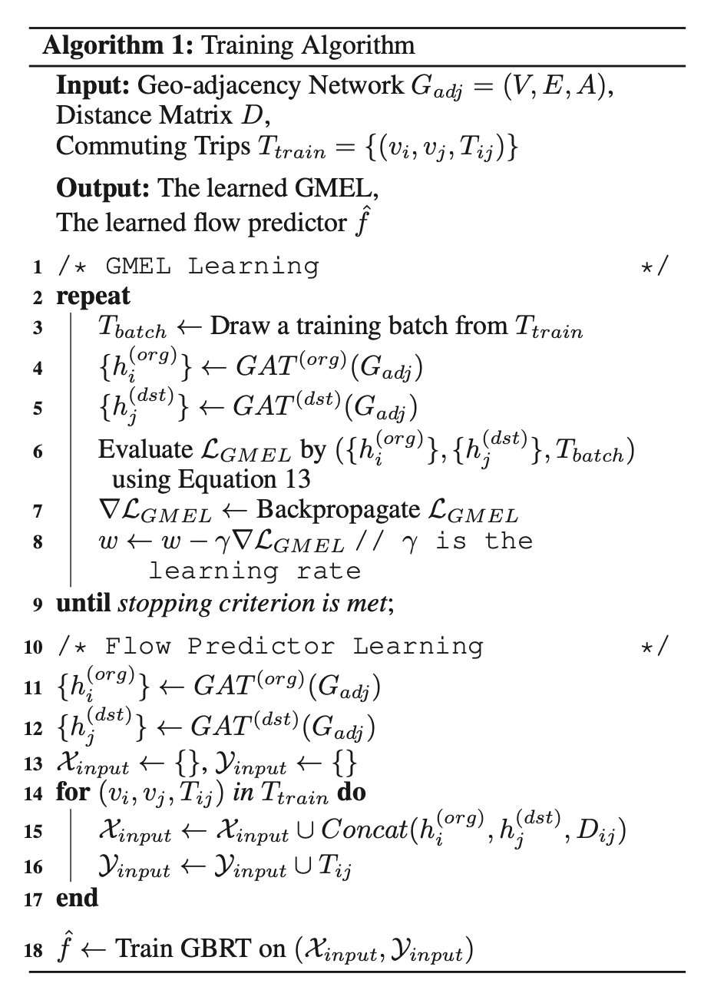
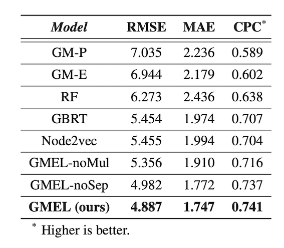
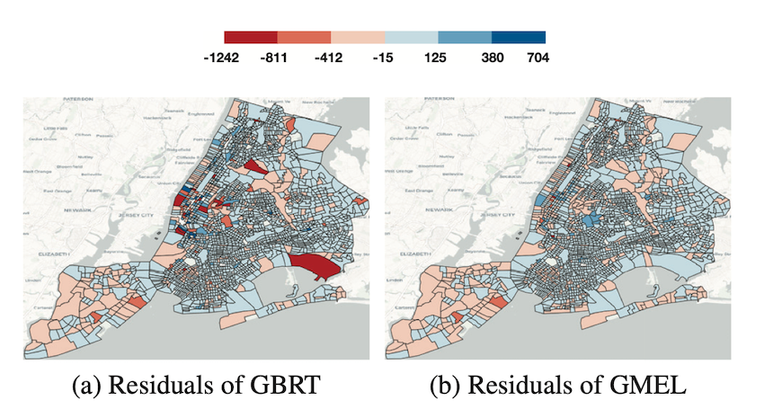

# Learning Geo-Contextual Embeddings for Commuting Flow Prediction
## 0x00 引言

本文章题为“用于**通勤流**预测的**地理上下文嵌入**学习”。

关键几个问题：

- 什么是通勤流？
- 什么是地理上下文？
- 如何对地理上下文信息进行嵌入学习？
- 该方法工作效果如何？存在什么缺陷吗？

### 通勤流

#### 什么是通勤流？

通勤是一种从家到工作地的往返过程。日复一日的通勤行为形成了一个与社会经济因素密切关联的复杂网络。

通勤流也被看作城市规划中的一个基本问题，因为其揭示了城市中劳动力供给与需求之间的空间关系。所以从城市规划的角度来看，有必要研究基础设施和土地利用对通勤流的影响。

通勤流

#### 通勤流预测与交通流预测有何区别？

说的通勤流预测可能又容易联想到交通流预测，两者有什么区别呢？

交通流预测是一个时序预测问题，在技术实现上需要将历史轨迹信息作为输入特征；而通勤流预测旨在揭示城市中劳动力供给侧与需求侧之间的空间关系，通常是只用节点属性信息（基建、土地利用）预测的是边级别的信号（如通勤流的大小）。

## 0x01 相关工作

### 通勤流相关工作

针对通勤流预测问题，人们以前有用重力模型、非参数模型、介入机会模型。

然而：

(1) 重力模型只是简单地将物理定律搬过来，实际上不能很好地刻画复杂的通勤模式，应用效果不理想。

(2) 现有的大多数机器学习模型只用OD点的节点属性特征，忽略了区域之间的空间依赖性

介入机会模型倒是考虑了出发地、目的地周边对中心的影响，本文提出的地理上下文嵌入便受到这类方法的启发。

### 图表征相关工作 

图表征学习方面也有很多利用节点属性、节点邻域信息的方法，本文方法主要受GAT的影响，将自注意力机制引入到通勤流预测上，捕获地理上下文信息。

## 0x02 本文观点

至此本文方法的基本框架已经出来了。

1. 针对通勤网络
2. 通过地理上下文嵌入学习地理单元及其上下文信息，通过多任务预测损失函数约束嵌入向量中的信息更适合进行通勤流预测。所谓的地理上下文信息就是指地理单元周围的POI、土地利用等信息，抽象来说就是邻域节点的属性。

GMEL

### 用GAT将地理上下文信息编码到嵌入空间中

这里要注意的是文章提出用2个GAT分别建模出发地和目的地的特征，即要把劳动供给侧和需求侧的特征进行解耦。

然后通过多任务学习框架约束嵌入向量更适应于流预测表示。

### 通过多任务学习框架约束嵌入向量更适应于通勤流预测

主任务自然是通勤流预测，子任务是预测两个地理单元（出发地和目的地）的流入/流出量，这背后的直觉是通勤流与地理单元的流入/流出量之间高度相关，引入这两个子任务可以约束嵌入向量包含更多有助于通勤流预测的信息（监督信号）。

### 基于GMEL和多任务学习框架的通勤流预测

前面基于GMEL可以获得地理单元的嵌入向量，基于这些向量在训练一个回归学习器（如梯度提升树、随机森林）便能进行通勤流预测。算法如下：

1. 端到端地训练一个GMEL（预训练过程）
2. 基于嵌入向量再训练一个流预测模型

训练算法

## 0x03 实验

实验部分需要验证的点包括：

- 地理上下文信息是否真的有助于通勤流预测？
- 使用两个GAT分别建模供给特征和需求特征是多此一举吗？
- 有必要引入多任务学习框架吗？

### 实验环境

用到了[通勤流](https://lehd.ces.census.gov/data/)、[土地利用](https://www1.nyc.gov/site/planning/data-maps/open-data/dwn-pluto-mappluto.page)的数据集和距离计算的包。

### 实验结果

观察实验结果可发现：

- 所有GMEL系列的模型都比基准模型要好，表明地理上下文信息有助于通勤流来说
- 标准的GMEL比另外两个变种表现好，验证了多任务学习框架的有效性和对供需特征解耦的必要性

测试表现

参数敏感性分析 、残差分析也表明方法的鲁棒性。

残差分析

## 0x04 结论

总结全文，文章提出利用地理上下文信息预测通勤流，并提出一个嵌入学习框架来学习地理单元的上下文信息，结果表明引入这种信息是有助于通勤流预测的。

