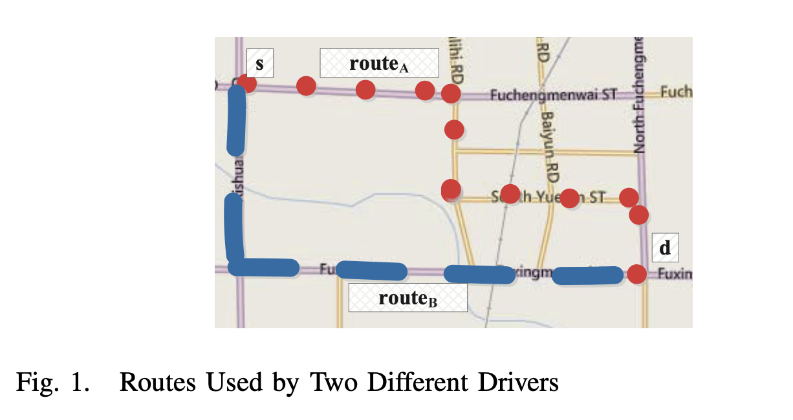

出行在我们的生活中扮演着重要的角色，越来越多的人选择使用车辆出行。为了方便选择路线，各种导航服务应运而生，在给出来源地、目的地，有时还给出出发时间时，就能推荐路线。然而，现有的导航服务所推荐的路线并不总是所有司机都喜欢的。例如，最近的一项研究表明，领先的导航服务提供的路线往往与当地司机选择的路线不一致[5]。

产生分歧的原因可能有两个方面。首先，现有的导航服务大多只考虑有限的几种出行成本，如距离或出行时间，以及尽量降低单一出行成本的返回路线，如最短路线或最快路线。相反，司机可能会考虑多种不同的出行成本。例如，由于公众环保意识的增强和燃料价格的高涨，许多驾驶员除了考虑旅行时间和旅行距离外，还越来越多地考虑燃料消耗[1]。

其次，现有的导航服务为所有驾驶员提供相同的路线(如最短路线或最快路线)，而且没有考虑到个别驾驶员的驾驶偏好(如省时驾驶、省油驾驶或两者之间的某种权衡)。

这些都促使我们研究如何对司机的驾驶偏好进行建模，为不同的司机提供个性化的路线，从而更好地满足司机的需求。

图1显示了两种不同的司机选择的路线，从源地s到目的地d，两条路线的距离相近。然而，路线A耗时较少，路线B耗油较少。这清楚地表明，两个司机有不同的驾驶偏好--一个试图节省时间，另一个旨在节省燃料。在很多情况下，司机也会根据多种出行成本的利益权衡来选择路线。由于不同的驾驶者可能有不同的权衡，单一的推荐路线不可能被所有驾驶者所选择。

随着车辆跟踪技术(如GPS)的快速发展和持续使用，大轨迹数据变得可用[24]、[16]。大轨迹数据为实现更好的导航服务提供了机会，如考虑多种出行成本和个体驾驶员的驾驶偏好。特别是，它可以根据驾驶员的驾驶轨迹来学习和更新他们的驾驶偏好。此外，当司机规划路线时，可以利用与司机有相似驾驶偏好的司机所使用的轨迹，向司机建议个性化的路线。

据我们所知，本文是第一篇探索利用大轨迹数据提供个性化路线推荐的可能性的论文。具体来说，本文有四个贡献。首先，它提出了一个基于大轨迹数据的个性化路线推荐的新问题。其次，它提出了从驾驶员的轨迹中建模和更新驾驶偏好的技术。我们的驾驶偏好模型可以支持任意数量的感兴趣的出行成本和成本比的分布。第三，它提出了一种局部和全局路线推荐算法，以推荐个性化路线给司机。该算法的新颖之处在于：(a)参考轨迹是从大轨迹中选取的，同时考虑驾驶偏好；(b)提出了本地和全局路线推荐，以支持不同的路线选择场景。第四，报告了在大量真实轨迹数据集上进行的综合实验。这些引出了本文建议的设计特性，并表征了个性化路线推荐的效率和效果。

本文的其余部分结构如下。第二节定义了驱动偏好，并将问题形式化。第三节描述索引。第四节描述参考轨迹的检索。第五节介绍个性化路线推荐方法。第六节报告实证评价。第七节回顾相关工作，第八节为本文的结论。

### 问题形式化

### 索引构建

### 轨迹检索

### 个性化路径推荐

### 实证研究

### 相关工作回顾

### 结论
我们提出并研究了利用大轨迹数据的个性化路线推荐问题。我们提供了驾驶员驾驶偏好的建模和更新技术，并提供了两种不同环境下高效、有效的个性化路线推荐方法：本地路线推荐和全局路线推荐。我们还提供了在本地路线推荐和全局路线推荐两种不同环境下推荐个性化路线的有效方法。通过大型真实轨迹数据集的实证研究表明，本文提出的建议是高效且有效的。

在未来的工作中，加入具有更丰富语义（如兴趣点）的资源来进行个性化的路线推荐是有意义的。此外，将其他驾驶偏好模型整合到个性化路线推荐框架中也很有意义。

## 相关资源
### 相关文章
- [Finding top-k shortest paths with diversity](https://ieeexplore.ieee.org/abstract/document/8107512)
    经典的K最短路径(KSP)问题，即在一个有向图中识别k条最短路径，在许多应用领域中发挥着重要作用，例如为车辆路由服务提供替代路径。然而，返回的k条最短路径可能高度相似，即共享大量的边，从而对服务质量产生不利影响。在本文中，我们形式化了K Shortest Paths with Diversity(KSPD)问题，该问题可以识别出top-k最短路径，使路径之间相互不相似，并且路径的总长度最小化。我们首先证明了KSPD问题是NP-hard的，然后提出了一个通用的贪婪框架来解决KSPD问题，其意义在于：(1)它支持文献中广泛采用的各种路径相似性度量；(2)如果没有指定路径相似性度量，它也能够有效地解决传统的KSP问题。该框架的核心包括使用两个经过精心设计的下界，其中一个下界依赖于所选的路径相似度量，另一个下界与所选的路径相似度量无关，从而有效地减小了搜索空间，显著提高了效率。通过对5个真实世界和合成图以及5个不同路径相似度量的实证研究，深入了解了所提出的一般框架的设计特性，并提供了所提出的下界是有效的证据。

- [Toward personalized, context-aware routing](https://link.springer.com/article/10.1007/s00778-015-0378-1)
    司机对前往目的地的路线的选择可能取决于路线的长度和行驶时间，但其他许多可能难以形成形式的方面也可能成为司机决定的因素。有证据表明，司机对路线的选择是依赖于上下文的，例如，在不同的时间段内，路线选择也因司机而异。相比之下，传统的路由服务几乎不支持上下文依赖性，它们向所有司机提供相同的路线。我们研究如何从历史轨迹中识别出个人司机的情境感知驾驶偏好，从而为个性化导航提供基础，也为专业的司机教育和交通规划提供基础。我们提供的技术能够从轨迹中捕捉动态旅行成本的时间依赖性和不确定性属性，如旅行时间和燃料消耗，我们提供的技术能够捕捉不同司机在多个动态旅行成本方面的驾驶行为。此外，我们还提出了能够识别驾驶员的上下文，然后利用驾驶员的历史轨迹识别每个上下文的驾驶偏好的技术。通过大量轨迹数据集的实证研究，为所提出的技术的设计特性提供了深刻的认识，并表明它们是有效的。

- [SemanticTraj: A New Approach to Interacting with Massive Taxi Trajectories](https://ieeexplore.ieee.org/abstract/document/7534822)
    海量出租车轨迹数据被用于交通和城市规划中的知识发现。现有的工具在检索和探索出租车轨迹和乘客行程时，通常需要用户在地图上选择和漫游地理空间区域。要回答一些看似简单的问题，如 "早上从主街出发，到华尔街结束的出租车车次是多少？"或者 "中午到达美术馆的出租车一般从哪里来？"由于轨迹的GPS数字点与 "主街"、"华尔街"、"美术馆 "等关键词没有直接关联，通常需要进行繁琐且耗时的交互。在本文中，我们提出了SemanticTraj，这是一种新的方法，用于以直观、丰富的语义和高效的方式管理和可视化出租车轨迹数据。通过SemanticTraj，领域和公众用户可以通过基于术语的直接查询，轻松找到上述问题的答案。他们还可以在由轨迹和行程的语义信息增强的可视化中交互式地探索检索到的数据。特别是，出租车轨迹通过文本化转换过程被转化为出租车文档。这个过程将GPS点映射成一系列的街道/POI名称和上/下车地点。它还将车速转化为用户定义的描述性术语。然后，形成一个出租车文档语料库并进行索引，以便在文本搜索引擎上进行灵活的语义查询。语义标签和结果的元摘要与SemanticTraj原型中的一套可视化功能集成在一起，这有助于用户快速、轻松地研究出租车轨迹。我们提出了一组使用场景，以展示该系统的可用性。我们还收集了领域专家的反馈意见，并进行了初步的用户研究，以评估该可视化系统。

- [Personalized and Situation-Aware Multimodal Route Recommendations: The FAVOUR Algorithm](https://ieeexplore.ieee.org/abstract/document/7502155)
    多模态网络中的路线选择在不同的个体和当前的情景语境之间表现出相当大的差异。推荐算法的个性化和情境感知在许多领域已经很常见，例如在线零售。然而，大多数在线路由应用仍然只提供最短距离或最短旅行时间的路线，忽视了个人的偏好以及当前的情况。在多模式环境下，这两个方面都尤为重要，因为一些交通模式的吸引力，如自行车，关键取决于个人特征和外生因素，如天气。作为一种替代方案，本文引入了FAVOUR（Fourite rOUte Recommendation）方法，以提供基于三个步骤的个性化、情境感知的路线建议：首先，在初始化阶段，用户提供有限的信息（家庭位置、工作地点、移动性选择、社会人口统计学），用于从少量初始配置文件中选择一个。其次，基于这些信息，设计一个陈述的偏好调查，以锐化配置文件。在这一步骤中，使用大众偏好先验（MPP）来编码来自步骤一中确定的类的偏好的先验知识。第三步，随后，在使用路由服务的过程中不断地更新轮廓。最后两步使用贝叶斯学习技术，以纳入所有贡献个体的信息。详细介绍了FAVOUR方法，并在少量的调查参与者身上进行了测试。在这个真实世界的数据集上的实验结果表明，FAVOUR产生的推荐质量比文献中的其他学习算法更好。特别是，第二步初始化的MPP的定义被证明比文献中的一些替代算法提供了更好的预测。

- [PLBS 2016][A heuristic for multi-modal route planning](https://link.springer.com/chapter/10.1007/978-3-319-47289-8_11)
    目前流行的多模式路线系统通常不只是将定期安排的公共交通与步行、自行车或汽车驾驶结合起来，很少包括其他出行选择，如拼车、汽车共享或自行车共享，以及根据个人用户的具体需求和偏好计算个性化结果的可能性。很少包括其他出行方式，如拼车、汽车共享或自行车共享，以及根据个人用户的具体需求和偏好计算个性化结果的可能性。部分原因是由于各种交通方式和用户需求的加入会迅速导致复杂的、语义丰富的图结构，这在一定程度上阻碍了动态图更新或路线查询等下游程序。在本文中，我们旨在通过使用前面的启发式来降低个性化多模式路由的计算工作量和规范复杂度，根据存储在用户配置文件中的信息，推导出一组可行的候选出行方案，然后可以通过传统的路由算法进行评估。我们通过两个实际例子来证明所提出的系统的适用性。

- [IJGIS 2018][A hybrid ensemble learning method for tourist route recommendations based on geo-tagged social networks](https://www.tandfonline.com/doi/abs/10.1080/13658816.2018.1458988)
    社交网络上的地理标签旅游照片通常包含兴趣点（POI）等位置数据，也包含用户的旅游偏好。在本文中，我们提出了一种混合型的集合学习方法BAyes-Knn，通过从这些位置标记数据中挖掘旅行者的地理偏好，为旅行者预测个性化的旅游路线。我们的方法训练了两种类型的基础分类器来共同预测下一个旅游目的地。(1)K-最近邻(KNN)分类器将用户的位置历史、天气状况、温度和季节性进行量化，并使用特征加权距离模型预测用户在未去过的地点的个性化兴趣。(2)贝叶斯分类器引入平稳内核函数来估计特征的先验概率，然后结合这些概率来预测用户在某个地点的潜在兴趣。通过使用Borda计数投票法，将这些子分类器的所有结果合并成一个最终的预测结果。我们在2005年1月1日至2016年7月1日收集的Flickr地理标签照片和北京天气数据上评估了我们的方法。结果表明，我们的合集方法优于其他12个基线模型。此外，结果表明，我们的框架比上下文感知的重要旅行序列模式推荐和频繁旅行序列模式有更好的预测精度。

- [IJCRR 2016][Learning Condition–Action Rules for Personalised Journey Recommendations](https://link.springer.com/chapter/10.1007/978-3-319-99906-7_21) 
    我们将学习分类器系统XCSI应用于为乘客提供个性化建议的任务中。学习型分类器系统将进化计算与基于规则的机器学习相结合，通过与环境的交互来改变规则群以实现目标。在这里，XCSI与模拟环境中的乘客在伦敦地铁网络中旅行，受到干扰的情况下进行交互。我们表明，XCSI成功地学习了个别乘客的偏好，并可用于在中断的情况下建议对继续旅行进行个性化调整。

- [Path cost distribution estimation using trajectory data](https://dl.acm.org/doi/abs/10.14778/3021924.3021926)
    随着车辆轨迹数据量的不断增加，越来越有可能捕捉到路网中时变和不确定的旅行成本，包括旅行时间和燃料消耗。目前的范式将路网表示为一个加权图；它将轨迹爆破成符合底层边缘的小碎片，为边缘分配权重；然后将路由算法应用于所得图。我们提出了一种新的范式，即混合图，其目标是更准确、更高效的路径成本分布估计。新的范式避免了将轨迹炸成小碎片，而是将权重分配给路径而不是简单的边。
    我们展示了如何使用轨迹数据计算路径权重，同时考虑到路径中边缘之间的旅行成本依赖性。给定一个出发时间和一个查询路径，我们展示了如何选择一个最优的权重集，其关联的路径覆盖了查询路径，并且这些权重能够为查询路径提供最精确的联合成本分布估计。然后利用联合分布准确计算出查询路径的成本分布。最后，我们展示了所得到的计算路径成本分布的方法如何可以整合到现有的路由算法中。来自两个不同城市的大量轨迹数据的实证研究为所提出的方法的设计特性提供了深刻的认识，并证实了该方法在现实世界中是有效的。

### 工作岗位
##### [地图搜索推荐算法工程师](https://www.zhipin.com/job_detail/e90a058006a29aa80XB839q0F1M~.html?ka=seo-search-word-job29_blank&lid=null)
岗位职责：
1. 负责百亿级别PV的地图路线排序或者召回引擎的算法研发；
2. 负责地图路线个性化推荐等方向的技术研发；
3. 研究搜索系统、推荐系统等相关机器学习技术解决出行问题，包括Learning To Rank、Deep Learning、Reinforcement Learning等；
任职要求：
1. 本科以上学历，数学、计算机、通信等相关专业；
2. 在广告、搜索、NLP、推荐系统、数据挖掘、路径规划等任一领域中至少三年经验，发表过高质量论文者优先；
3. 熟悉常见的分类、排序、深度学习等机器学习算法；熟悉常用的特征工程方法；
4. 熟悉Linux编程环境，有 hadoop/spark或其他类似大数据平台工作经验；
5. 拥有扎实的算法基础和良好的沟通合作能力；
6. 熟悉地图业务/路径规划算法/权值算法背景是plus。
7. 有团队管理相关经验优先。

##### [AI地图算法工程师](https://www.zhipin.com/job_detail/9ed3f38a033fc5bb0XB839q-GVU~.html?ka=seo-search-word-job26_blank&lid=null)
利用滴滴海量的出行数据，对路线达到时间估计，路线规划，路况计算，路径还原等问题进行建模，使用数据挖掘和机器学习技术优化滴滴地理信息模型，提升滴滴用户的出行体验和平台效率，保障司乘安全；
任职要求：
1. 熟悉常用的机器学习算法，例如GBDT、LR、LTR，深度学习，强化学习等
2. 熟悉常用的特征工程方法
3. 熟练掌握Python,Scala,C++ 中至少一门语言，并能快速熟悉其他语言
有使用hadoop/spark/mpi 或其他类似系统的经验
4. 责任心强，有快速学习的能力