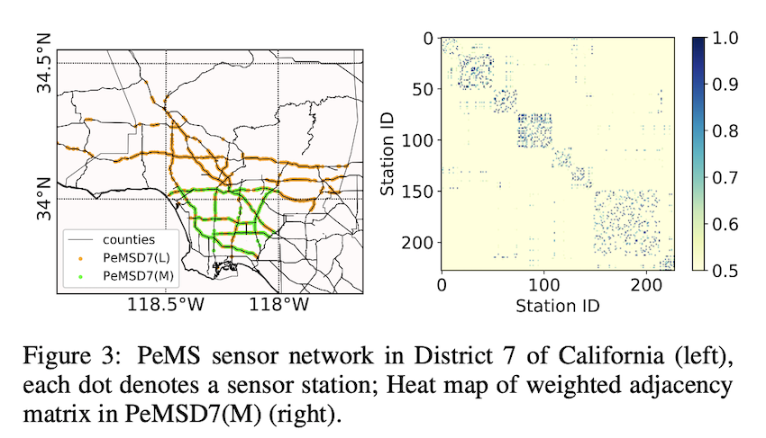
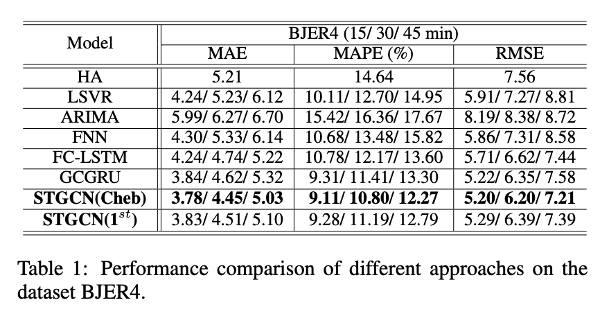
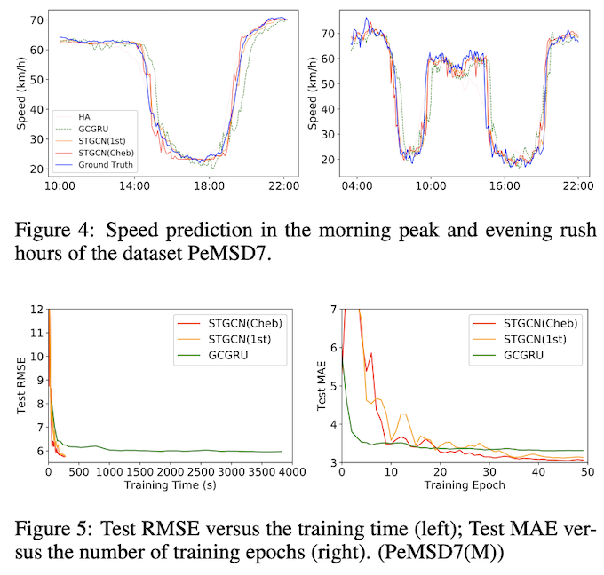

## 文章分析
### 引言

为了充分利用空间特征，一些研究者使用卷积神经网络（CNN）来捕捉交通网络之间的相邻关系，同时在时间轴上采用循环神经网络（RNN）。通过结合长短期记忆（LSTM）网络[Hochreiter和Schmidhuber，1997]和一维CNN，Wu和Tan[2016]提出了一种用于短期交通预测的特征级融合架构CLTFP。虽然采用了简单明了的策略，但CLTFP还是首次尝试将空间和时间规律性统一起来。之后，Shi等人[2015]提出了卷积LSTM，它是一种扩展的全连接LSTM（FC-LSTM），内嵌卷积层。但是，应用的普通卷积操作限制了模型只能处理网格结构（如图像、视频），而不是一般的域。同时，用于序列学习的递归网络需要进行迭代训练，这就引入了分步的误差积累。此外，基于RNN的网络（包括LSTM）通常被认为难以训练且计算量大。

为了克服这些问题，我们引入了几种策略来有效地模拟交通流的时间动态和空间依赖性。为了充分利用空间信息，我们用一个总图来模拟交通网络，而不是单独处理（如网格或段）。为了处理循环网络的固有缺陷，我们在时间轴上采用了完全卷积结构。最重要的是，我们提出了一种新型的深度学习架构，即时空图卷积网络，用于交通预测任务。该架构由多个时空卷积块组成，它是图卷积层[Defferrard et al.，2016]和卷积序列学习层的组合，以模拟空间和时间上的依赖关系。据我们所知，这是第一次在交通研究中应用纯卷积结构从图结构的时间序列中同时提取时空特征。我们在两个真实世界的交通数据集上评估了我们提出的模型。实验表明，我们的框架在多种预设预测长度和网络规模的预测任务中优于现有的基线。

### 方法

#### 网络架构
在本节中，我们将详细介绍所提出的时空图卷积网络（STGCN）的架构。如图2所示，STGCN由多个时空卷积块组成，每个时空卷积块组成一个 "三明治 "结构，其中有两个门控顺序卷积层，中间有一个空间图卷积层。各个模块的细节介绍如下。

##### 基于图CNN提取空间特征
交通网一般以图的结构来组织。将道路网作为图形进行数学表述是自然和合理的。然而，以往的研究忽视了交通网的空间属性：由于交通网被分割成多个片段或网格，因此忽略了交通网的连通性和全局性。即使在网格上进行二维卷积，由于数据建模的妥协，也只能大致捕捉到空间的局部性。 因此，在我们的模型中，图卷积被直接运用在图结构数据上，以提取空间域中有意义的模式和特征。虽然在图卷积中，由式(2)计算内核Θ可能是昂贵的，由于O(n2)乘法与图傅里叶基础，两个近似策略被应用来克服这个问题：
- 切比雪夫多项式近似（Chebyshev Polynomials Approximation）
- 一阶近似（$1^{st}$-order Approximation）
- 图卷积的推广

##### 用于提取时间特征的门控 CNNs
虽然基于RNN的模型在时间序列分析中变得广泛，但用于交通预测的循环网络仍然存在着耗时的迭代、复杂的门机制和对动态变化的缓慢响应的问题。而CNN具有训练速度快、结构简单、与前几步无依赖性约束等优点。受[Gehring等，2017]的启发，我们在时间轴上采用整个卷积结构来捕捉交通流的时间动态行为。这种特殊的设计通过多层卷积结构形成的分层表示，可以实现并行和可控的训练过程。

##### 时空卷积模块
为了融合来自空间和时间域的特征，构建了时空卷积块（ST-Conv block）来联合处理图结构的时间序列。块本身可以根据特定情况的规模和复杂性进行堆叠或扩展。
如图2（中）所示，中间的空间层是为了衔接两个时间层，可以实现图卷积通过时间卷积的快速空间状态传播。同时，"三明治 "结构也有助于网络充分应用瓶颈策略，通过图卷积层对通道C进行降频和升频，实现规模压缩和特征挤压。此外，在每个ST-Conv块内都利用层归一化来防止过拟合。

现在我们将我们的模型STGCN的主要特点总结如下：
- STGCN是一个处理结构化时间序列的通用框架。它不仅能够解决交通网络建模和预测问题，而且能够应用于更普遍的时空序列学习任务。

- 时空块结合了图形卷积和门控时空卷积，可以提取最有用的空间特征，并连贯地捕捉最本质的时空特征。

- 该模型完全由卷积结构组成，因此以较少的参数和较快的训练速度实现了对输入的并行化。更重要的是，这种经济的架构使得该模型可以更高效地处理大规模网络。

### 实验
#### 数据集描述
我们在两个真实世界的交通数据集上验证我们的模型，BJER4和PeMSD7，分别由北京市交通委员会和加州交通部收集。每个数据集都包含了交通观测的关键属性和地理信息，并有相应的时间戳，具体如下。
##### BJER4
BJER4是通过双环检测仪采集北京市东环4号线路的主要区域。我们的实验共选取了12条道路。每5分钟汇总一次交通数据。所用时间段为2014年7月1日至8月31日，周末除外。我们选择第一个月的历史车速记录作为训练集，其余分别作为验证集和测试集。

##### PeMSD7
PeMSD7是由加州交通局的性能监测系统(PeMS)收集的，该系统由部署在加州公路系统主要城市地区的39,000多个传感器站实时收集[Chen等，2001]。数据集也由30秒的数据样本汇总成5分钟的时间间隔。我们在加州第7区中随机选取一个中等规模和一个大规模，分别包含228个和1026个站点，分别标注为PeMSD7(M)和PeMSD7(L)，作为数据源(如图3左侧所示)。PeMSD7数据集的时间范围为2012年5月和6月的工作日。我们基于上述相同的原则，将训练集和测试集进行拆分。

#### 数据预处理
两个数据集的标准时间间隔设置为5分钟。因此，道路图的每个节点每天包含288个数据点。在数据清洗后，采用线性插值法填补缺失值。另外，输入的数据采用Z-Score法进行归一化处理。

在BJER4中，通过传感器站的部署图，构建了北京东四环路系统的道路图拓扑结构。通过整理每条道路的隶属关系、方向和起止点，可以将环线系统数字化为有向图。

在PeMSD7中，道路图的邻接矩阵是根据交通网中各站点之间的距离来计算的。加权邻接矩阵W可以形成为：

#### 实验设置
所有的实验都是在Linux集群上编译和测试的（CPU: Intel(R) Xeon(R) CPU E5-2620 v4 @ 2.10GHz, GPU: NVIDIA GeForce GTX 1080）) 为了消除非典型交通，我们的经验中只采用工作日的交通数据[Li et al.] 我们执行网格搜索策略来定位验证上的最佳参数。所有的测试都采用60分钟作为历史时间窗口，也就是12个观察到的数据点（M=12）来预测未来15、30、45分钟的交通状况（H=3、6、9）。

#### 实验结果
表1和表2展示了STGCN和基线在数据集BJER4和PeMSD7（M/L）上的结果。我们提出的模型在三个评价指标中都取得了具有统计学意义的最佳性能（双尾T检验，α=0.01，P<0.01）。我们可以很容易地观察到，传统的统计和机器学习方法在短期预测中可能表现良好，但由于误差积累、记忆问题和空间信息的缺失，其长期预测并不准确。ARIMA模型由于无法处理复杂的时空数据而表现最差。深度学习方法普遍取得了比传统机器学习模型更好的预测结果。

##### 空间拓扑的好处
以往的方法没有结合空间拓扑结构，对时间序列进行粗粒度建模。不同的是，通过对传感器的空间拓扑建模，我们的模型STGCN在短期和中长期预报上取得了显著的提高。在数据集PeMSD7上，STGCN的优势比BJER4更加明显，因为PeMS的传感器网络更加复杂，结构更加复杂(如图3所示)，我们的模型可以有效地利用空间结构进行更准确的预测。为了比较三种基于图卷积的方法。GCGRU、STGCN(Cheb)和STGCN(1st)三种方法，我们展示了它们在早晚高峰时段的预测结果，如图4所示。很容易观察到，我们提出的STGCN比其他方法更准确地捕捉到了高峰时段的趋势；而且它比其他方法更早地检测到了高峰时段的结束。我们的模型由于高效的图卷积和堆叠的时间卷积结构，能够快速响应交通网络之间的动态变化，而不像大多数循环网络那样过度依赖历史平均值。

##### 训练效率和泛化性
为了看到我们提出的沿时间轴卷积的好处，我们在表3中总结了STGCN和GCGRU的训练时间对比。在公平性方面，GCGRU由三层组成，分别在实验中为PeMSD7(M)提供64、64、128个单元，STGCN使用了4.3节所述的默认设置。我们的模型STGCN只消耗了272秒，而RNN型的模型GCGRU在PeMSD7(M)上花费了3824秒。这种14倍的训练速度的加快主要得益于应用了时间卷积而不是递归结构，可以实现完全并行训练，而不是像RNN那样完全依靠链式结构。对于PeMSD7(L)来说，由于GCGRU的GPU消耗超过了单卡的内存容量，因此不得不使用一半的批处理量(结果在表2中标为 "*");而STGCN只需要将ST-Conv块中间的通道增加一倍。

### 相关工作
最近有一些深度学习研究也是以图卷积在时空任务中的应用为动机。Seo等人[2016]引入了图卷积循环网络（GCRN），从结构化的数据序列中共同识别空间结构和动态变化。本研究的关键挑战是确定特定环境下循环网络和图卷积的最佳组合。基于上述原理，Li等人[2018]成功地采用门控递归单元（GRU）与图卷积进行长期交通预测。与这些工作相比，我们的模型完全由卷积结构建立起来；ST-Conv块是专门为统一处理结构化数据而设计的，内部有残差连接和瓶颈策略；我们的模型中也采用了更高效的图卷积核。

### 结论
在本文中，我们提出了一种新型的深度学习框架STGCN用于交通预测，通过时空卷积块整合图卷积和门控时空卷积。实验表明，我们的模型在两个真实世界的数据集上的表现优于其他最先进的方法，表明其在从输入中探索时空结构上的巨大潜力。它还实现了更快的训练，更容易收敛，更少的参数，灵活的灵活性和可扩展性。这些特点对于学术发展和大规模的行业部署都是相当有前景和实用的。在未来，我们将进一步优化网络工作结构和参数设置。此外，我们提出的框架还可以应用到更多的时空结构化序列预测场景中，如社交网络的演化、推荐系统的偏好预测等。
