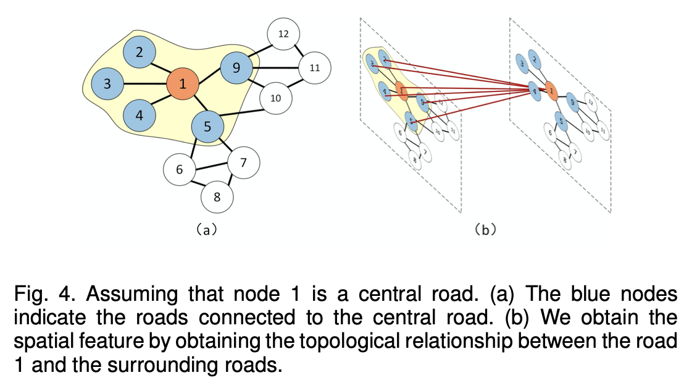
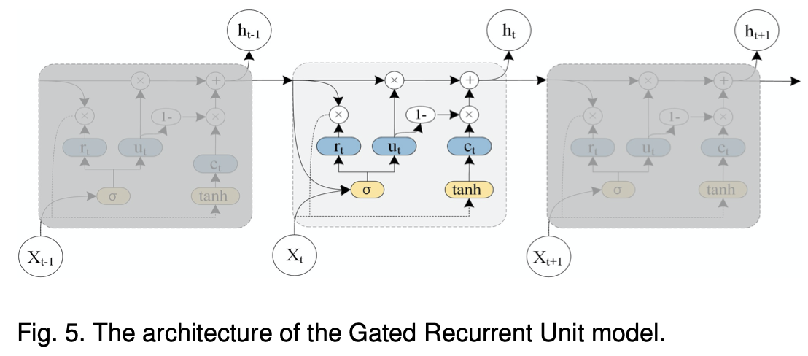
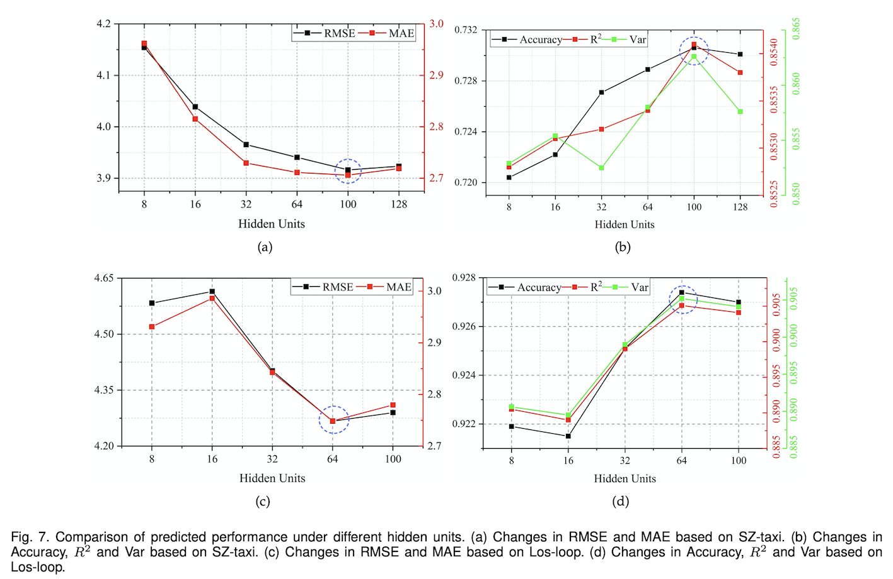
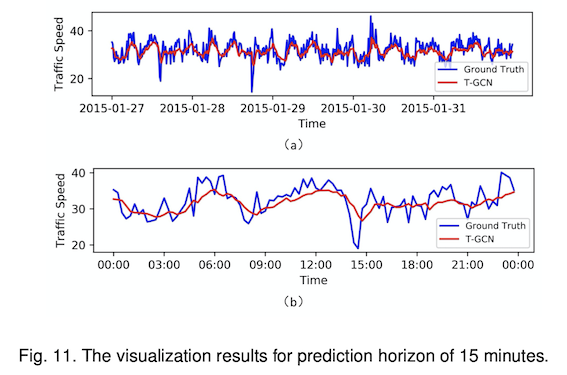
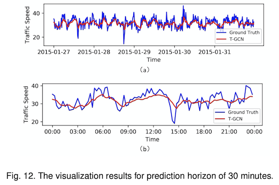
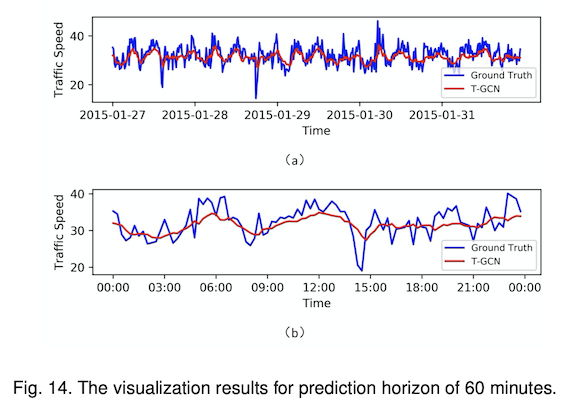

# T-GCN: A Temporal Graph Convolutional Network for Traffic Prediction

## 文章分析
### 本文工作
以上方法考虑了交通状况的动态变化，但忽略了空间上的依赖性，即对于预测模型而言交通状况的变化不受路网的约束，因此无法准确预测交通数据的状态。为了更好地描述空间特征，一些研究[14]、[15]、[16]引入卷积神经网络进行空间建模，然而卷积神经网络通常用于图像、规则网格等欧式数据[17]。这种模型在拓扑结构复杂的城市路网环境下无法工作，所以本质上无法描述空间依赖性。

为了解决上述问题，我们提出了一种新的交通预测方法，称为时间图卷积网络（T-GCN），用于基于城市路网的交通预测任务。我们的贡献有三个方面：

(1) 结合图卷积网络和门控递归单元，提出T-GCN模型。图卷积网络用于捕捉路网的拓扑结构，以建立空间依赖性模型。门控递归单元用于捕捉道路上交通数据的动态变化，以模拟时间依赖性。T-GCN模型还可以应用于其他时空预测任务。

(2) T-GCN模型的预测结果在不同的预测范围下呈现稳定状态，说明T-GCN模型不仅可以实现短期预测，还可以用于长期的交通预测任务。

(3) 我们利用深圳市罗湖区出租车速度数据和Los-loop数据集对我们的方法进行评估。结果表明，我们的方法与所有基线方法相比，预测误差降低了约1.5%-57.8%，这表明T-GCN模型在交通预测方面具有优越性。

### 前人工作
智能交通系统交通预测是当今的主要研究课题之一。现有的交通预测方法可分为两类：模型驱动法和数据驱动法。首先，模型驱动法主要解释交通量、速度、密度之间的瞬时和稳态关系。这类方法需要在已有知识的基础上进行全面的、去尾的系统建模。代表性的方法包含排队理论模型[18]、小区传输模型[19]、交通速度模型[20]、微观基本图模型[21]等。现实中，交通数据受多种因素影响，很难得到准确的交通模型。现有的模型无法准确描述复杂现实环境中交通数据的变化。此外，这些模型的构建需要大量的计算能力[22]，并且容易受到交通干扰和采样点间距等因素的制约。

其次，数据驱动方法根据数据的统计规律性推断变化趋势，最终用于预测和评价交通状态[23]，[24]。这类方法不分析交通系统的物理特性和动态行为，具有较高的灵活性。较早的方法包括历史平均模型[2]，即用历史时期交通量的平均值作为预测值。这种方法不需要任何假设，计算简单快速，但不能很好地适应时间特征，预测精度较低。随着对交通量预测研究的不断深入，出现了大量预测精度较高的方法，主要可分为参数模型和非参数模型[25]、[26]。

参数模型以回归函数为前提，通过对原始数据的处理确定参数，然后根据回归函数实现交通预测。时间序列模型、线性回归模型[27]、[28]和卡尔曼滤波模型是常用的方法。时间序列模型是将观测到的时间序列拟合成参数模型来预测未来的数据。早在1976年，Box和Jenkins[5]就提出了自回归积分移动平均模型（Autoregressive Integrate Moving Average Model，ARIMA），这是最广泛使用的时间序列模型。1995年，Hamed等人[6]利用ARIMA模型预测城市干道的交通量。为了提高模型的预测精度，产生了不同的变体，包括Kohonen ARIMA[29]、子集ARIMA[30]、季节性ARIMA[31]等。Lippi等[32]将支持向量回归模型与季节性ARIMA模型进行比较，发现SARIMA模型在交通拥堵方面有更好的效果。线性回归模型根据历史交通数据建立回归函数来预测交通流量。2004年，Sun等[27]利用局部线性模型解决了区间预测问题，在实际交通数据集上取得了较好的效果。卡尔曼滤波模型根据前一时刻和当前时刻的交通状态预测未来的交通状况。1984年，Okutani等人[7]利用卡尔曼滤波理论建立了交通流状态预测模型。随后，一些研究[33]、[34]利用卡尔曼滤波模型实现了交通预测任务。

传统的参数模型具有算法简单、计算方便的特点，但这些模型依赖于静止的假设，不能反映交通数据的非线性和不确定性特征，不能克服交通事故等随机事件的干扰。非参数模型可以很好地解决这些问题，只需要足够的历史数据就可以自动学习交通数据的统计规律性。常见的非参数模型包括：k-最近邻模型[10]、支持向量回归模型[8]、[9]、[35]、模糊逻辑模型[36]、贝叶斯网络模型[11]、神经网络模型等。

近年来，随着深度学习[37]、[38]、[39]的快速发展，深度神经网络模型由于能够很好地捕捉交通数据的动态特征，取得了目前最好的效果，因此受到了人们的关注。根据是否考虑空间依赖性，可以将模型分为两类。有些方法只考虑时间依赖性，如Park等[40]采用Feed Forward NN实现交通流预测任务。Huang等[12]提出了一种由深度信念网络(DBN)和回归模型组成的网络架构，并验证了该网络可以从多个数据集的交通数据中捕获随机特征，该模型提高了交通预测的预测能力。此外，由于循环神经网络(RNN)及其变体具有长短期记忆(LSTM)，门控循环单元(GRU)可以有效利用自循环机制，因此可以很好地学习时间依赖性，取得较好的预测效果[13]，[41]。

这些模型考虑了时间上的特征，但忽略了空间上的依赖性，使交通数据的变化不受城市路网的约束，因而不能准确预测道路上的交通状态。充分利用空间和时间的依赖性是解决交通预测问题的关键。为了更好地描述空间特征，许多研究都在此基础上进行了改进。Lv等[42]提出了一种SAE模型，从交通数据中捕捉时空特征，实现短期交通流量预测。Zhang等[14]提出了一种名为ST-ResNet的深度学习模型，为人群流动的时间紧密性、周期性和趋势性每个属性设计了残差卷积网络，然后将三个网络和外部因素动态聚合，预测城市各区域人群的流入和流出。Wu等[15]结合CNN和LSTM设计了一种短期预测的特征融合架构。采用一维CNN来捕捉空间依赖性，采用两个LSTM来挖掘交通流的短期变化和周期性。Cao等[16]提出了一种名为ITRCN的端到端模型，将交互式网络流量转化为图像，利用CNN捕捉流量的交互函数，利用GRU提取时间特征，证明该模型的预测误差分别比GRU和CNN高14.3%和13.0%.Ke等[43]提出了一种新的深度学习方法，称为融合卷积长短期记忆网络(FCL-Net)，考虑空间依赖性、时间依赖性和外生依赖性进行短期客流需求预测。Yu等[44]利用深度卷积神经网络(DCNN)捕捉空间依赖性，利用LSTM捕捉时间动态性，并通过北京交通网数据实验证明了SRCN模型的优越性。

虽然上述方法引入了CNN来模拟空间依赖性，并在交通预测任务中取得了很大的进展，但CNN基本上适用于欧氏空间，如图像、规则网格等，对具有复杂拓扑结构的交通网络有一定的局限性，因而不能从本质上描述空间依赖性。因此，这类方法也存在一定的缺陷。近年来，随着图卷积网络模型[45]的发展，可以用来捕捉图网络的结构特征，为上述问题提供了很好的解决方案。Li等[46]提出了一种DCRNN模型，该模型通过在图上的随机行走来捕捉空间特征，通过编码器-解码器结构来捕捉时间特征。

基于这样的背景，本文提出了一种新的神经网络方法，可以从交通数据中捕捉复杂的时间和空间特征，然后可以用于基于城市路网的交通预测任务。

### 方法
在本文中，交通预测的目标是根据道路上的历史交通信息，预测一定时期内的交通信息。在我们的方法中，交通信息是一个笼统的概念，可以是交通速度、交通流量和交通密度。在不失一般性的前提下，我们在实验部分以交通速度作为交通信息的例子。

#### 概述
本节将介绍如何利用T-GCN模型实现基于城市道路的交通预测任务。具体来说，T-GCN模型由图卷积网络和门控递归单元两部分组成。如图3所示，首先，我们以历史n个时间序列数据为输入，利用图卷积网络捕捉城市路网的拓扑结构，得到空间特征。其次，将得到的具有空间特征的时间序列输入到门控递归单元模型中，通过单元之间的信息传递得到动态变化，捕捉时间特征。最后，我们通过全连接层得到结果。

#### 模型
##### 空间依赖建模
获取复杂的空间依赖性是交通预测中的一个关键问题。传统的卷积神经网络(CNN)可以获得局部空间特征，但它只能在欧氏空间中使用，如图像、规则网格等。城市路网是以图的形式而不是二维网格的形式，这意味着CNN模型不能反映城市路网复杂的拓扑结构，因而不能准确地捕捉空间依赖性。最近，将CNN泛化为图卷积网络（GCN），可以处理任意的图结构数据，受到广泛关注。GCN模型已经成功地用于许多应用，包括文档分类[17]、无监督学习[45]和图像分类[47]。GCN模型在傅里叶域构造一个滤波器，滤波器作用于图的节点及其一阶邻域，捕捉节点之间的空间特征，然后通过堆叠多个卷积层，就可以建立GCN模型。如图4所示，假设节点1为中心道路，GCN模型可以得到中心道路与其周围道路之间的拓扑关系，对道路网络的拓扑结构和道路上的属性进行编码，然后得到空间依赖性。综上所述，我们利用GCN模型[47]从交通数据中学习空间特征。2层的GCN模型可以表示为：

$f(X,A)=\sigma(\hat{A} Relu(\hat{A}XW_{0})W_1)$

##### 时间依赖建模
获取时间依赖性是交通预测的另一个关键问题。目前，用于处理序列数据的神经网络模型中，应用最广泛的是循环神经网络（RNN）。但由于存在梯度消失和梯度爆炸等缺陷，传统的循环神经网络对于长期预测有一定的局限性[48]。LSTM模型[49]和GRU模型[50]是循环神经网络的变种，已被证明可以解决上述问题。LSTM和GRU的基本原理大致相同[51].它们都是利用门控机制来记忆尽可能多的长期信息，对各种任务同样有效。但由于LSTM结构复杂，训练时间较长，而GRU模型结构相对简单，参数较少，训练能力较快。因此，我们选择GRU模型从交通数据中获取时间依赖性。如图5所示，$h_{t-1}$表示时间t-1时的隐藏状态；$x_t$表示时间t时的交通信息；$r_t$为复位门，用于控制对前一时刻状态信息的忽略程度；$u_t$为更新门，用于控制将前一时刻的状态信息带入当前状态的程度；$c_t$为时间t时存储的内存内容；$h_t$为时刻t时的输出状态。GRU以时刻t-1的隐藏状态和当前的交通信息作为输入，获取时刻t的交通状态。在获取当前时刻的交通信息的同时，模型仍然保留了历史交通信息的变化趋势，具有捕捉时间依赖性的能力。

##### 时空图卷积
为了同时捕捉交通数据的空间和时间依赖性，我们提出了一种基于图卷积网络和门控递归单元的时空图卷积网络模型（T-GCN）。如图6所示，左边是时空交通预测的过程，右边是T-GCN单元的具体结构，$h_{t-1}$表示时间t-1时的输出，GC为图卷积过程，$u_t$、$r_t$为时间t的更新门和复位门，$h_t$表示时间t的输出，具体计算过程如下图所示，$f(A,X_t)$表示图卷积过程，定义为式2。W和b代表训练过程中的权重和偏差。

综上所述，T-GCN模型可以处理复杂的空间依赖性和时间动态性。 一方面，利用图卷积网络来捕捉城市路网的拓扑结构，以获得空间依赖性。另一方面，利用门控递归单元来捕捉道路上交通信息的动态变化，以获得时间上的依赖性，最终实现交通预测任务。

##### 损失函数
在训练过程中，目标是将误差——道路上的实际交通速度与预测速度之间的差距降到最低。我们用$Y$和$\hat{Y}$表示实际的交通速度和预测的速度，分别为。T-GCN模型的损失函数如式7所示。第一个项用于最小化实际交通速度与预测速度之间的误差。 第二项$L_{reg}$是L2正则项用于减少过拟合。

### 实验
#### 数据集描述
##### SZ-taxi
这个数据集是2015年1月1日至1月31日深圳的出租车轨迹。我们选取罗湖区156条主要道路作为研究区域。实验数据主要包括两部分。一个是156*156的邻接矩阵，它描述了道路之间的空间关系。每一行代表一条道路，矩阵中的数值代表道路之间的连通性。另一个是特征矩阵，它描述的是每条道路的速度随时间的变化。每一行代表一条道路；每一列是不同时间段道路的交通速度。我们每隔15分钟对每条道路的交通速度进行汇总。

##### Los-loop
Los-loop。本数据集是在洛杉矶县的高速公路上通过环路检测器实时收集的。我们选取了2012年3月1日至3月7日期间的207个传感器及其交通速度。我们每5分钟汇总一次交通速度。相似性，数据总结出一个邻接矩阵和一个特征矩阵。邻接矩阵是由交通网络中传感器之间的距离计算出来的。由于Los-loop数据集包含一些缺失的数据，本文使用线性插值法来填补缺失值。

#### 参数设置
##### 超参数设置
T-GCN模型的超参数主要包括：学习率、批次大小、训练epoch和隐藏层数。在实验中，我们手动调整并设置学习率为0.001，批次大小为64，训练epoch为3000。

隐藏单元的数量是T-GCN模型中一个非常重要的参数，因为不同的隐藏单元可能会大大影响预测精度。为了选择最佳值，我们对不同的隐藏单元进行实验，通过比较预测结果来选择最佳值。

在实验中，对于SZ-taxi数据集，我们从[8，16，32，64，100，128]中选择隐藏单元数，分析预测精度的变化。如7所示，横轴代表隐藏单元数，纵轴代表不同指标的变化。图7(a)是不同隐藏单元的RMSE和MAE的结果。可以看出，当数量为100时，误差最小。图7(b)显示了不同隐藏单元的Accuracy、R2和Var的变化情况。同样，当数量为100时，结果达到最大。综上所述，当数量设置为100时，预测结果最好。当增加隐藏单元的数量时，预测精度先增大后减小。这主要是因为当隐藏单元大于一定程度时，模型的复杂度和计算难度都会大大增加，因此，预测精度会有所降低。因此，我们在所有实验中都将隐藏单元的数量设置为100。

同样的方法，Los-loop的结果如7(c)和7(d)所示，可以看出，当隐藏单元数为64时，预测精度最高，预测误差最小。

##### 数据划分
对于输入层，在训练过程中取训练数据集（占整体数据的80%）作为输入，其余数据作为测试过程的输入。T-GCN模型采用Adam优化器进行训练。

#### 实验结果
与baseline模型对比。
- History Average model（HA）
- Autoregressive Integrated Moving Average model (ARIMA) 
- Support Vector Regression model (SVR)
- Graph Convolutional Network model (GCN)
- Gated Recurrent Unit model (GRU)

表1是T-GCN模型和其他基线方法在SZ-taxi和Los-loop数据集上15分钟、30分钟、45分钟和60分钟的情况。∗表示数值太小，可以忽略不计，说明模型的预测效果不好。可以看出，T-GCN模型在所有的评价指标下，在所有的预测范围内都获得了最好的预测性能，证明了T-GCN模型在时空交通预测中的有效性。

#### 扰动性分析
在现实世界的数据采集过程中，不可避免地存在噪声。为了检验T-GCN模型的抗噪声能力，我们通过扰动分析实验来检验模型的鲁棒性。

#### 模型解释性
为了更好地理解T-GCN模型，我们在SZ-taxi数据集上选择一条道路，对测试集的预测结果进行可视化。图11、图12、图13和图14分别显示了15分钟、30分钟、45分钟和60分钟的预测视野的可视化结果。这些结果显示：

(1)T-GCN模型在峰值处预测效果不佳。我们推测主要原因是GCN模型在傅里叶域定义了一个平滑滤波器，通过不断移动滤波器来捕捉空间特征。这个过程会导致整体预测结果发生微小的变化，使得峰值更加平滑。

(2)实际交通量的形成与预测结果之间存在一定的误差。误差之一主要是因为当道路上没有出租车时，就不会有零值的信息记录。另一个误差是由于当交通信息值较小时，微小的差异会造成较大的相对误差。

(3)无论预测范围如何，T-GCN模型总能取得较好的效果。T-GCN模型可以捕捉时空特征，获得道路上交通信息的变化趋势。此外，T-GCN模型还能检测到高峰期的开始和结束时间，并做出与实际交通速度相似的预测结果。这些特性对于预测交通拥堵等交通现象有很大帮助。

### 总结
本文提出了一种基于神经网络的新型交通预测方法，称为T-GCN，它结合了GCN和GRU。我们采用图网络对城市道路网进行建模，图上的节点代表道路，边代表道路之间的连接关系，道路上的交通信息被描述为图上节点的属性。一方面，利用GCN捕捉图的拓扑结构，得到空间上的依赖性；另一方面，利用GRU模型捕捉节点属性的动态变化，得到时间上的依赖性。最终采用T-GCN模型来解决时空交通预测任务。在两个真实世界的交通数据集上进行评估，并与HA模型、ARIMA模型、SVR模型、GCN模型和GRU模型进行比较，T-GCN模型在不同的预测视野下取得了最好的预测效果。此外，扰动分析也说明了我们方法的稳健性。综上所述，T-GCN模型可以成功-充分捕捉交通数据的时空特征，并且不局限于交通预测，还可以应用于其他时空任务。

## 问题
- 以往的交通预测方法对于交通高低峰的捕捉情况如何？
- gnn所处理的路网（输入数据），如何划分为好？