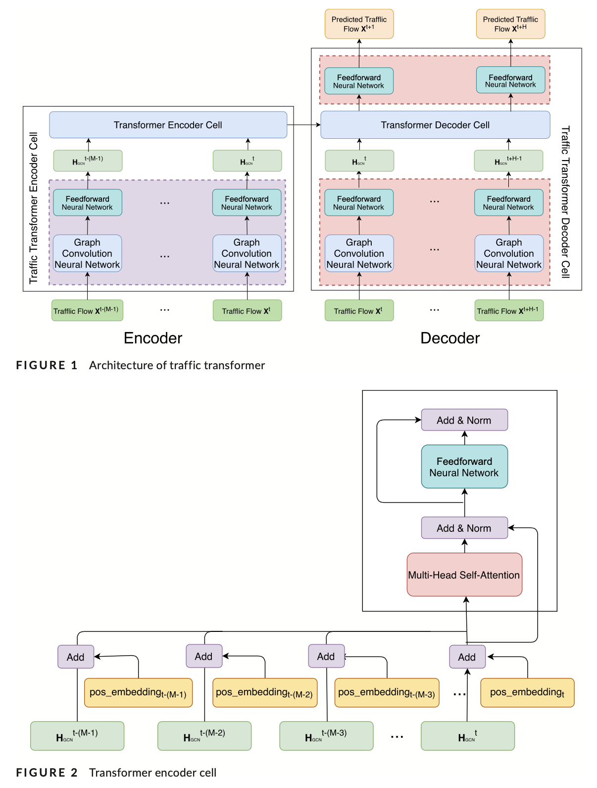

## 文章分析
### 引言
交通预测是指通过分析历史交通状况和模式，估计未来的交通状况(如车辆密度和速度)，从而预测未来的事件(如拥堵或旅行时间)。高精度的预测可以为决策者提供指导，为市民提供安全和便利，并减少环境影响。

然而，由于不同尺度的交通状况的时空依赖性建模的复杂性，交通预测具有挑战性（Davis，Raina，& Jagannathan，2019；Wu，Tan，Qin，Ran，& Jiang，2018）。例如，一条道路的交通流量既受其历史交通状况的影响，也受上游道路状况的影响。由于海量交通数据、高性能计算和新型深度学习模型的不断增加，最近的工作推动了用于精确交通预测的时空依赖模型的工作。

基于递归神经网络（RNNs）的模型，如门控递归单元（GRU）和长短期记忆（LSTM），可以有效地用于捕捉时间依赖性（Cui等，2018；Jin等，2018）。例如，Shi等(2015)提出了一个用于交通预测的卷积LSTM模型，其中每个时间步的交通流被递归地输入到LSTM架构中。同样，Li，Yu，Shahabi和Liu（2017）提出了一个卷积RNN模型，其中使用图扩散卷积运算符来模拟空间依赖性，并采用GRU代替LSTM来捕获时间依赖性。

虽然这些基于RNN的模型可以捕捉到时间上的顺序依赖性，但RNN有几个固有的缺陷。首先，它们难以保存非常长期的序列信息，这导致了时间序列在前进路径中失去长期的时间依赖性（Khandelwal，He，Qi，& Jurafsky，2018）。其次，RNNs无法捕捉时间序列的周期性，因为它们对时间序列中的不同时间步长一视同仁。这是一个重要的缺陷，因为时间序列通常传达周期性模式，如每小时、每天、每周和季节性（Guo，Lin，Feng，Song，& Wan，2019；Yao等人，2019）。第三，RNNs难以并行化，使得训练和预测过程的效率降低。

最近，研究人员推出了Transformer架构来取代RNNs进行机器翻译（Vaswani等人，2017）。它取代了卷积神经网络（CNNs）和RNNs，并且完全建立在注意力机制上，以模拟顺序数据。因此，Transformer不需要递归地输入顺序数据。这使得该架构在计算上比RNNs更高效。更重要的是，为了在对序列建模时保留序列中元素的顺序（如句子中单词的顺序），Transformer引入了一种位置编码策略。它对序列（如句子）中元素（如词）的位置进行编码，首先按位置进行索引，然后将索引通过一系列正弦函数。Transformer及其变体在自然语言处理中取得了巨大的成功，包括机器翻译和文本生成（Dai等人，2019；Devlin，Chang，Lee，& Toutanova，2018；Radford，Narasimhan，Salimans，& Sutskever，2018）。

有趣的是，机器翻译和流量预测在结构上有一些相似之处。在机器翻译中（Wu等，2016），目的是通过使用序列到序列的学习框架（Sutskever，Vinyals，& Le，2014），将一种语言书写的源句翻译成另一种语言的目标句，其中源序列和目标序列都由标记组成。交通预测也可以用类似的方式来制定。更具体地说，任务是利用关于历史交通状况的数据，使其成为未来状况的指示性，其中源序列由过去的一系列交通数据（如交通量、速度）组成，目标序列由未来时间步的一系列交通状况组成。换句话说，源交通序列和目标交通序列中的每个时间步可以类比为机器翻译任务中输入和输出句子中每个词的位置指数。

根据定义，类比是局部的。因此，Transformer不能直接应用于交通预测，原因如下。首先，位置编码策略不适用。在机器翻译和交通预测中，源序列和目标序列的语义是不同的。在机器翻译中，源序列和目标序列代表了不同语言中意义相同的两个句子，因此，两个序列中对应的词应该共享相同的位置索引。相反，在交通预测中，源-目标序列是连续的；因此，源序列和目标序列中的元素之间没有对应关系。相反，交通量预测在对交通量按其时间步长进行索引时，考虑到了时间序列的连续性。此外，交通数据还具有时间的其他一些特性，如周期性。例如，周三下午3点某条道路的交通状况与周四同一时间的交通状况相似。在对Transformer进行调整以适应这一领域时，也应考虑交通数据的周期性特征。因此，这就需要在Transformer架构中采用新的方式来编码时间特征。其次，Transformer只能处理机器翻译中源序列和目标序列之间的顺序依赖性，而交通数据中的空间（网络信息）和时间（顺序信息）依赖性非常突出（Cui，Henrickson，Ke，& Wang，2019；Ma等人，2017）。因此，我们需要使Transformer能够连贯地处理空间和时间依赖性。

为了解决这些问题，我们提出设计不同的时间信息编码策略，使交通数据的连续性和周期性都能得到保留，并借助图卷积网络(GCNs)将Transformer扩展到对时间和空间依赖性共同建模。我们研究的主要贡献如下：

1. 我们设计了四种新颖的位置编码策略，对时间序列的连续性和周期性进行编码，以方便对交通数据的时间依赖性进行建模。通过结合不同的策略，我们共提出了7种时间编码方法。
2. 我们引入了一种名为Traffic Transformer的混合编码器-解码器架构，以端到端训练的方式对交通数据的空间依赖性和时间依赖性进行连贯建模，其中Transformer被用来对时间依赖性进行建模，GCNs则有助于空间依赖性的建模。
3. 在两个真实世界基准数据集上的实验结果显示了我们的模型与最先进的方法相比的性能，证明了我们的时间编码方法和混合架构的有效性。

本文其余部分的结构如下。第2节回顾了现有的交通预测工作。
第3节定义了交通预测任务并介绍了Transformer。第4节介绍了编码时间特征的不同策略以及所提出的交通预测架构。第5节解释了我们的实验并介绍了结果。最后，第6节总结了我们的工作，并指出了未来研究的方向。
### 相关工作
### 方法
#### Traffic transformer架构

### 结论
在这项研究中，我们已经引入了新颖的非经常性架构，称为Traffic Transformer。我们已经成功地将其用于交通预测，以捕获时空依赖性。这个架构可以看作是自然语言处理中一个著名的顺序模型Transformer的扩展。为了探索如何在Transformer中捕获时空依赖性，我们提出了七种不同的时间序列的连续性和周期性建模方法。时间序列分段法取得了最好的效果。另外，我们在Transformer中引入了图卷积神经网络，用于建模交通的空间依赖性。通过这样做，可以捕捉到流量的动态时空特征。在两个基准数据集上的广泛实验表明，我们的模型优于基线，展示了我们提出的时空编码方法和我们提出的整体架构的有效性。本文的一个局限性是，我们只考虑了时间上的注意力机制，而不同时间的上游道路可能会有不同的贡献。在未来的工作中，我们将探索如何设计时空注意力机制，以更精细地解决这个问题。