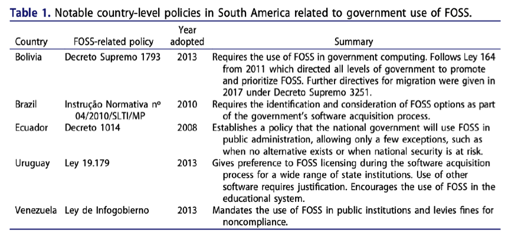
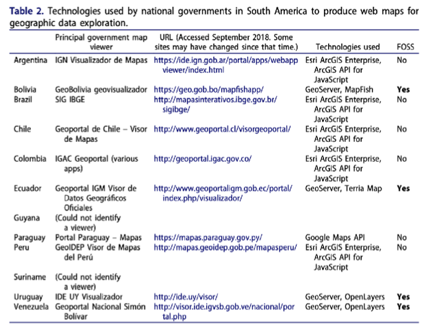
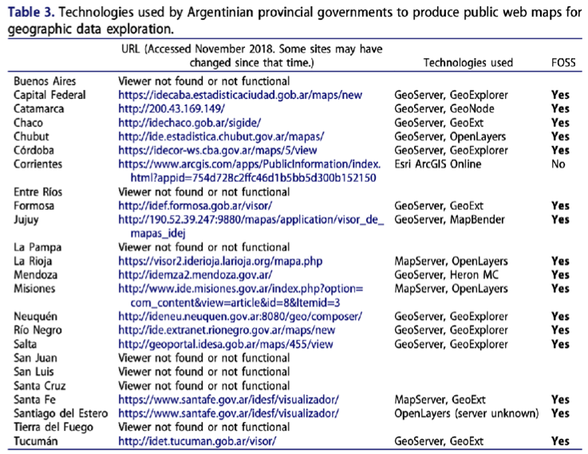

## Free and open source GIS in South America: political inroads and local advocacy

ZhuGuowei, 2020-12-13

---

## 0x00 Outline
 
- Public openness toward FOSS in South America

- FOSS GIS in South America

- Case studies of FOSS GIS community activity

---

## 0x01 Introduction
--- 
### What does FOSS and FOSS GIS mean?
{} 
- Freedom to **run** the program as you wish

- freedom to **study and change** the program

- freedom to **redistribute** copies

- freedom to **distribute copies of your modified versions**

 {}
{}
In contrast: proprietary software restricts access to the source code and
often requires license fees.
{}

---

<!-- ### FOSS GIS and proprietary GIS -->

##### proprietary GIS software

- ArcGIS
- MapInfo
- Manifold GIS

---
##### FOSS GIS software
- **Desktop-based mapping and data processing**:
  *QGIS、GRASS、gvSIG、SAGA*

- **Web service publishing**:

  *MapServer、GeoServer*

- **Website programming**:

  *Leaflet、OpenLayers*

- **Backend data storage**:

  *PostreSQL、PostGIS*

--- 
### Why should we pay attention to FOSS GIS in South Amerca?
1. there is a **substantial FOSS GIS adoption** occurring in some South American governments,

2. this uptake maybe occurring for **a different mix of reasons**  than observed or expected with FOSS adoptions in the Global North.

---
## 0x02 Public openness toward FOSS in South America
---

South America has seen a unique variety of laws and decrees
 at the city, state, and federal levels promoting FOSS use on government computers

Figure 1. Notable country-level policies in South America related to goverment use of FOSS
<!-- 
南美洲国家政府对于FOSS的政策法令
 -->

---

Beyond encouraging FOSS, some governments even mandate its use for state business. For examples, 
- Venezuela’s ‘Infogobierno’ law requires public institutions migrate to FOSS

- Bolivia has enacted a series of decrees leading toward public sector migration to FOSS

the tendency to adopt strict mandates of FOSS was more common in Latin America and Africa than in other parts of the world. 
Policies in other regions tended to take more of a hands-off advisory role.

---

### Why have these South American governments been so aggressive about adopting FOSS?
- Technical factors 

- Economic factors 

- Social factors 

- Political factors

---
##### Technical factors

- Recent government crackdowns on illegal software copying are leading public institutions to look for lower-cost software alternatives

- Some have recognized FOSS solutions as a way to not only economize, but also foster local skills, develop context-specific applications, and institute social changes

- These licenses also allow modification and redistribution of the code, providing a way to fix, enhance, or internationalize the software without waiting for a vendor to release a (potentially costly) upgrade. 

--- 
##### Economic factors
- An attractive element of FOSS for the public sector is that the software can be distributed without licensing fees

-  The amount of money required to keep proprietary software running in government offices  is substantial

--- 
##### Social factors
- The reasons for government promotion of FOSS in South America go beyond economics, and involve attitudes about society, sovereignty, and the role of the state.

- Chan (2004) noted that this line of reasoning represented a key difference from FOSS promotion in North America, where supporters tended to emphasize FOSS’s protection of consumer freedoms.
---
##### Political factors

-  the idea of FOSS is an avenue to independence from the perceived imperialism of US-based proprietary software companies has appeared across social stratum.

- Free software represents the values: equality, freedom, sovereignty, right to choose, democracy, and development.

---
## 0x03 FOSS GIS in South America
---
 four countries, which have supported FOSS through legislation or decree at the national level,  using FOSS GIS for their principal map viewers (Bolivia, Ecuador, Uruguay, and Venezuela).

Brazil is the only country with national support for FOSS that is not using FOSS in its principal map viewer

---
 Most of the provincial sites in the below table are using well-known and basic FOSS GIS software. 

stability and long-term maintenance of some of the sites appear to be challenges.

---
##### Local technical support groups for FOSS GIS
- exchange troubleshooting tips, 

- share ideas and success stories, 

- post employment information,

- arrange conferences and meetups of people with similar skills and interests.

---

##### Local software development

- An important indication of FOSS GIS presence in any region is the local production and improvement of software

- FOSS development is evidence of this process occurring. FOSS GIS development efforts in South America include the aforementioned
  - translation of user interfaces,
  - the testing and use of products,
  - the creation of new software to meet community needs.

--- 

Ibero-America has incubated several FOSS GIS programs that are widely used in South America.
- One of these is gvSIG, a desktop GIS program developed in Valencia, Spain.

- Another GIS, called SPRING, was developed by the Brazilian National Institute for Space Research (INPE).

- Other open source GIS tools developed by Brazilian government and educational institutions include i3Geo, E-foto, and TerraLib

--- 

## 0x04 Case studies of FOSS GIS community activity

---
- FOSS GIS Brasil magazine 

- Geoinquietos Argentina 

- FOSS.4GIS.GOV conferences in Brazil

---

### FOSS GIS Brasil magazine
- the most ambitious effort ever to publish information about FOSS GIS in periodical format was a Portuguese language magazine.

- The magazine included articles about:
  - FOSS GIS software options
  - comparing functionalities of FOSS GIS with proprietary software
  - case studies of successful software implementations in various branches of the Brazilian government
  - interviews with figureheads in the Brazilian FOSS GIS community

--- 

### Geoinquietos Argentina
- Geoinquietos is a network of local groups throughout Ibero- America interested in geospatial sciences and FOSS.
  - the main objective is to  share knowledge and effort

  - the group is completely anarchic; there is  no hierarchy of participants.

  - jovial, relaxed, and occasionally very technical banter

--- 
### Geoinquietos Argentina

  - The Geoinquietos Argentina chapter has been one of the most active of these groups,

  - repeatedly organizing conferences that attract hundreds of people from the Southern Cone area of South America and beyond.
--- 
### FOSS.4GIS.GOV conferences in Brazil

- The success of Geoinquietos Argentina at gathering the FOSS GIS community was noticed in other areas of South America.

- Actually, several notable gatherings of open source GIS software enthusiasts have occurred in Brazil’s capital, but they have largely focused on government applications.

- the FOSS.4GIS.GOV conference brought together hundreds of professionals.

---

## 0x05 Conclusions
---
- FOSS GIS has a strong and growing presence in South America, evidenced by
  - government use of FOSS in interactive map websites,
  - the variety of FOSS technical support groups for GIS and mapping, and the development of software to meet local geoprocessing needs.

--- 
- Some of this success is likely due to the generally friendly attitude toward FOSS throughout the region, where some governments have mandated that FOSS be used, or at least considered, as an alternative to proprietary software.

--- 

- Such affinity toward FOSS includes economic considerations, but also a strong belief that national interest is served by keeping software code transparent and investment money local.

---
- This article discussed three case studies of particularly successful efforts to promote FOSS GIS and rally local user groups through education and sharing of technical expertise.

- The common thread between these case studies is their ability to connect individuals. 

---

# Thanks!
